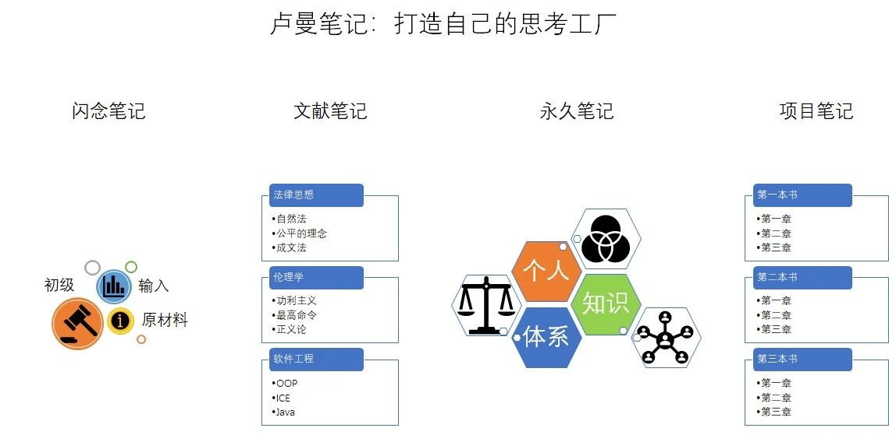
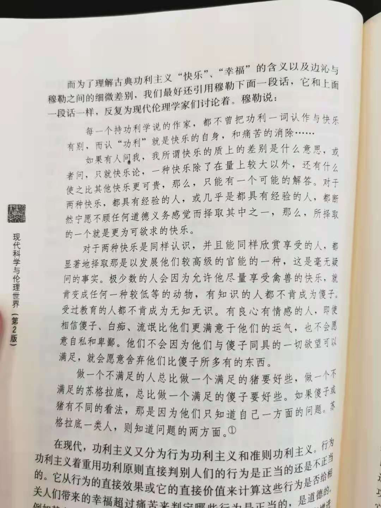
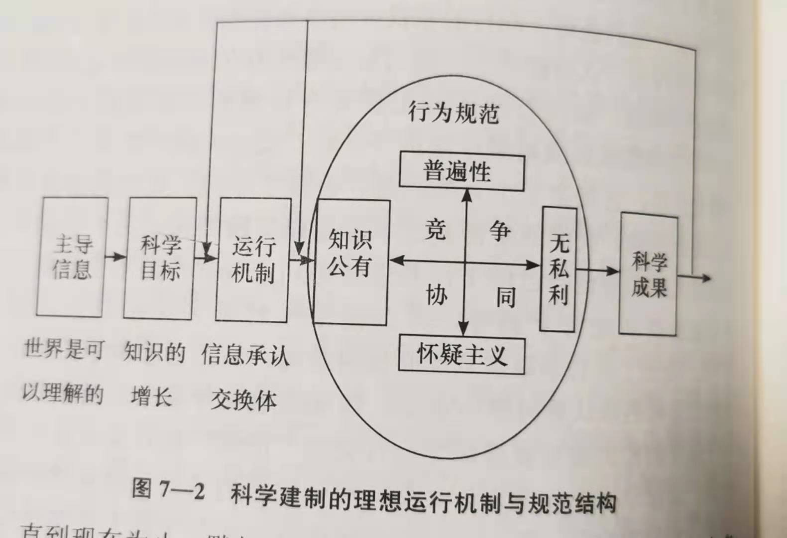
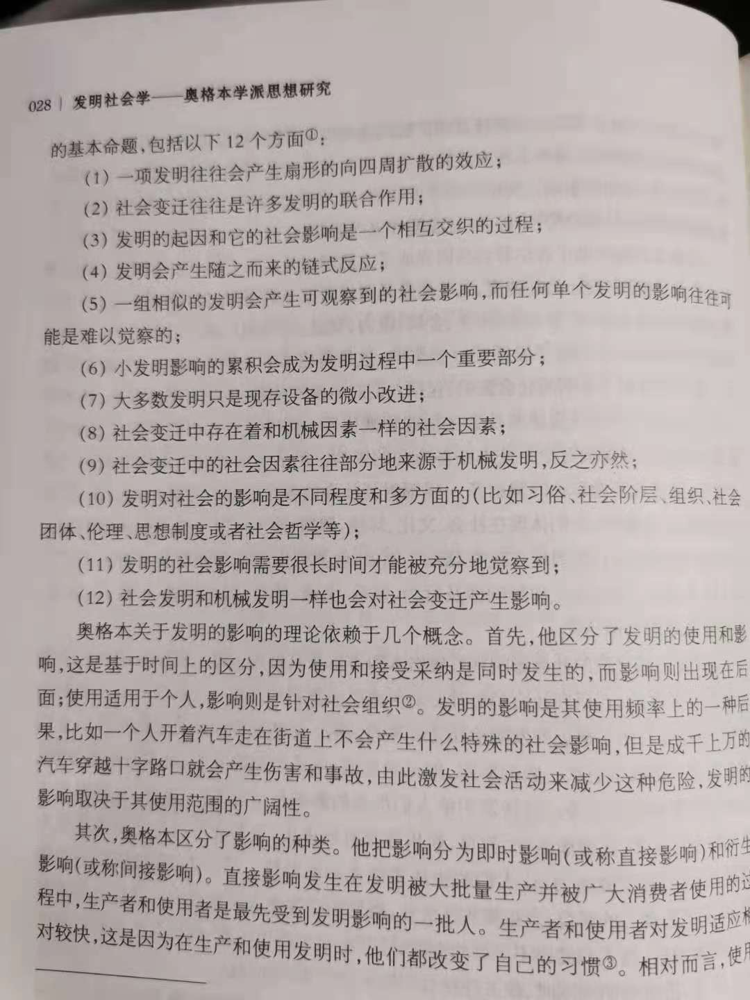

- 2021-02-02
	- 关于《Code 2.0》突然想通一点：在过去的慢节奏社会，用礼代替法律就能管好；现代社会节奏与变化加快，法律就成为必须；在未来社会，节奏越来越快，法律的能力都会不足，所以必须靠code。
- 2021-02-03
	- MindShare的数据结构，还是一个麻烦：如何确定一个Block，是基于Markdown的自然对象（太碎），还是基于用户的---分隔符（麻烦）
- 2021-02-06
	- 无论是朋友圈还是Twitter，到处都在热议ClubHouse，搞得我也心痒难耐，然而却没法安装。无论你是不是喜欢，无论你是正面评价还是负面评价，无论你是看涨还是看跌。这已经是一个现象级的产品了。
- 2021-04-20
	- 写作计划
		- 《开源：献给世界的礼物》
		- 《后人类与近未来》
		- 《一种基于模型与合理预期的生活态度》
		- 《对于复杂性保持警惕》
- 2021-04-20
	- 现在我在notion每日记日记已经停了，在多邻国学外语，也处于低水平坚持的状态。虽然最近其实读书很多，思考和产出也不少。
	- 想到一个主题，《开放性系统设计模式》，需要考虑各种变化，比如数据结构，API，稳定性，服务负载等等。
- 2021-04-26
	- 写作计划
		- 《复杂的世界，难有简单的对错——针对技术的伦理思考》
- 2021-05-06
  id:: 628341b6-aeed-4994-afde-4ac464df2899
	- 读《华夏边缘》与《礼物的流动》，突然想明白一个问题：贵重的礼物+盛大的礼仪，是为了在周边人群与社会中，“写入”集体记忆。而在开源社区，针对开源贡献的榜单，也有类似的效果。
- 2021-05-07
	- 读《礼物的流动》，联想到：原始平等社会，人的地位来自于他的“奉献”。而在现代复杂社会，人的地位已经不会直接依赖与他的“付出”，而是由上面直接任命的结果。所有，他可以有单向收礼，而无需回礼的特权。
	- 社会地位，可以分为：由贡献而来的荣誉地位；由个人奋斗而来的成就地位；由组织任命而来的职务地位（或结构性地位）；以及由社交网络而来的关系地位。
	- 首先是社会伦理，对于人的评价，是关于哪些行为值得赞赏，哪些行为值得谴责的。几乎所有的社会伦理，都会赞赏慷慨、无私、愿意付出、热心公益的人。但是：某一个人的社会地位，不仅仅取决于他的付出和贡献。或者说：越是复杂社会，越是不仅仅以此来评价一个人。
	- 其次是对于这种评价背后的解释，中国是一个对于礼有着深入的自我分析与自我总结的民族，所以其礼的理论与实践，都会从古代谚语与俗语中，找到很多根据。而更多的原始部落，缺乏这样的理性总结与归纳，才会总结为“豪”这种奇奇怪怪的“礼物之灵”。
	- 最后，我们需要一种理论，去整体性的理解一个人的行为与其社会地位之间的关系。以及理解在一个网络上的虚拟社区，在民族性与地域性被大大削弱之后，纯粹的贡献与分享，带来的社会地位提升。
	- 西方人类学，关注礼物，却忽略了礼物背后的礼，的确有买椟还珠之嫌。
	- 在礼物与关系中，应用理性人假设，最大的问题在于：大多数人其实没有那么理性。他们的计算可能是不充分的，甚至是片面的，一时冲动的。在此基础上做出的决策，事后只能另外找合理化的因素来解释。
- 2021-05-10
	- 安装了一个名叫《元思笔记》的App，再次尝试使用卢曼卡片法。不过在看了介绍之后，发现有些理念，与我当年设计的SBBS有些类似。可惜，当初没有坚持做下去。
- 2021-05-11
	- 关于笔记，我的感想是三个关键词：工具、习惯、意愿。
	- 工具：其实我一直没有找到能坚持使用的工具，包括notion、xx笔记、也许还要继续找
	- 习惯：养成定期整理、回顾、汇总、梳理的习惯，可能是一个关键，但是这个非常难。不知道有没有好的工具，能帮助我们养成这个习惯。
	- 意愿：我发现，带着一个特定的（大问题）读书的时候，更加容易引发思考与联想，收获也比较多。漫无目的的阅读，效果就不行。
	- 写作计划
		- 简单的提纲：
		- 1. 基于多模型的世界观和方法论
		- 2. 基于儒家人性论，入世主义的人生观
		- 3. 基于功利主义的，用模型度量的价值观
- 2021-05-13
	- 孙歌：《寻找亚洲》
		- 读孙歌《寻找亚洲》，却越发觉得，在全球化的今天，中国需要具备的不是亚洲视野，而是全球视野。中国是世界的中国，而不仅仅是亚洲（东亚）的中国。
		- 从全球视野的角度来看，中国需要更加积极的发展人类学，从中国出发，去理解全世界。不是高高在上，也不是“相对主义”，而是和而不同，美美与共。
		- 无论是亚洲作为方法，还是中国作为方法，儒学作为方法，本质上都是：某人提出了一个方法，看看能够走多远。他的方法的影响力与涉及面，能够介入到多少的领域。从这种意义上来说：开源作为方法，一种开放性的方法，我认为更有前途。
		- 执着于西方或者非西方，普遍性还是个殊性，其实意义不大。从多模型的角度来看，一种模型的描述能力，涵盖范围，可能是有限的，但不是局限国别、地域、民族、人种这些天然的界限，而是另有边界。意识到有边界，也意识到多种模型的边界互相重叠，能够在多个模型之间跳跃（转换模式），才是思考的基本功。
		- 理论的旅行需要一个必须的条件，那就是它需要脱掉直观的外衣，变形为与不同社会历史相应的新的形态。在这种变形之后，理论原有的框架和结论都不再具有重要意义，而它所提供的洞察力本身则会以不同的形态再生。
	- 陈嘉映作品集
		- https://book.douban.com/series/33730
- 2021-05-17
	- 人生观：穷则独善其身，达则兼济天下（背后是对于人性的理解，以及对世界的理解）
	- 兼济天下：基于多模型的世界观与开放性的方法论
	- 独善其身：基于价值观的自我修养与伦理判断
	- 吾日三省吾身（内省）
	- 己所不欲勿施于人（自我约束）
	- 独乐乐不如众乐乐（功利主义）
- 2021-05-21
	- 读《寻找亚洲》：超克分断体制的，不是统一，而是和解。来自韩国，白樂晴。深以为然！
- 2021-05-28
	- 模型是一种描绘，模型选择描绘一个事物，是出于某种目的的。能够达到这一目的的模型，就是有用的。目的规定了模型的适用范围。模型与模型之间，可能会存在冲突，这种冲突需要被另一个模型解释。
- 2021-05-29
	- 开放性系统架构：拼贴与一致；开放与可靠；迭代与规划。
- 2021-05-30
	- 对自己抽丝剥茧，对世界刨根问底
- 2021-06-14
	- Code是一个复杂现象，不能仅仅因为它的书写形式，就类比于“言论”（Code is Speech），然后用言论自由的逻辑，为开源/自由软件撑腰。Code is Law，所以需要被监管，Code is Tech，所以需要被善用。
- 2021-06-16
	- 通过代码掌控更多数据，通过数据训练出更好的代码。代码加数据的组合，使得垄断的优势被进一步放大。
- 2021-07-05
	- 《开源面面观》：以万法观开源、由开源生万法
- 2021-07-07
	- 个人的内在价值，最终目的，不是求快乐，不是求善，而是求心安。所谓心安，是因为人有自我评估与反省的能力，反省时候，心安即可。如果心不安，不妥帖，那么无论是快乐，还是善，都是成问题的。但是，何谓心安呢？首先是对自己有一个衡量的准则，这个准则是一致的，无矛盾的，知行合一的，就能心安。
- 2021-07-08
	- 警惕双标
	- 关于汉服的双标：中国 vs. 韩国
	- 在《论自由》中的双标：摩门教 vs. 鸦片战争
	- 以双标，看谁收了钱：香港青年 vs. 爱国老外
	- 如何警惕双标？
- 2021-07-12 09:16:51
	- **工具、方法与方法论**
	- 总有些谈方法论的作品，在说：工具不重要。这其实存在误解
	- 线索一：工具限制了方法的选择，在方法的基础上，才能总结出方法论
	- 线索二：基于方法论改进方法，基于方法选择工具、改进工具、甚至创造新的工具
	- 事实上，以上的线索一与线索二，是一个循环往复的过程
	- 无论是子弹笔记还是卢曼笔记，都是一种“方法”，当然，这种非常有价值的方法，本身就蕴含着方法论
	- 我们作为方法的实践者，还是需要不断反省与总结自己的方法论，然后才能有意识的挑选到适合自己的工具。
- 2021-07-12
	- 
- 2021-07-13
	- 一个猜想：在人类学之前，才会诞生社会契约论这样的学说。因为西方人在当年过于迷信契约，却对于真正的社会变化过程，缺乏了解。
	- 情理法的顺序，是自然演进。社会契约论，却以法的思维，去推测伦理如何出现，大谬！
- 2021-07-14
	- 一般的功利主义原则，所求的收益会有一个简单的加总求和。但是这会带来一个坏处：某人的受损，被其他人的受益抵消了。更好的功利主义，应该是利害不相抵的。极端的、正义的功利主义，应该是最小受损原则（而不是最大受益原则）。另一个值得讨论的问题是：实际受损与比较差异之后的心理受损。大家都有收获，但是一旦引入比较，受益较少的人，也会有不公平的受害感。所以，一个公开公平的社会，应该在信息公开的前提下，重新计算整体受益。当然，选择蒙蔽群众，也是一种“解法”。
	- 对于开源社区的研究，从感性的总结，到定性的比较分析，再到定量的深入研究，现在刚刚开始第三个阶段。对于开源项目的帮助，尤其是工具方面的帮助，也需要借助上面的定量研究，然后补足短板，提升关键环节的效率。
- 2021-07-14
	- {:height 1116, :width 541}
	-
	- 从需要有高低，很容易变成需要的人有贤愚贵贱，那些低贱愚蠢之人的需求，简直就可以忽略不计！
- 2021-07-15
	- 我的伦理原则：
	- 个人不做什么：己所不欲，勿施于人
	- 个人要做什么：反省自己，能够心安
	- 社会不做什么：众所不欲，立法禁止
	- 社会应做什么：计算损失，代价最小
- 2021-07-23
	- 
	- 公有性，普遍性，无私利，独创性与怀疑主义，组成了CUDOS，即“荣誉、名誉、声誉”
	- {:height 152, :width 639}
	- 当我越是学习人类学，我就越是不能心安理得，底气十足的坚持自己的确信的立场了。
- 2021-07-28
	- 美国社会学家罗伯特·金·莫顿（Robert K. Merton）提出科学伦理四项基本原则：
		- Communism: the common ownership of scientific discoveries, according to which scientists give up intellectual property in exchange for recognition and esteem.
		- Universalism: according to which claims to truth are evaluated in terms of universal or impersonal criteria, and not on the basis of race, class, gender, religion, or nationality;
		- Disinterestedness: according to which scientists are rewarded for acting in ways that outwardly appear to be selfless; and
		- Organized Skepticism: all ideas must be tested and are subject to rigorous, structured community scrutiny.
	- Robert_K._Merton#Sociology_of_science_and_CUDOS [en.wikipedia.org](https://en.wikipedia.org/wiki/Robert_K._Merton#Sociology_of_science_and_CUDOS)
	- Mertonian_norms: https://en.wikipedia.org/wiki/Mertonian_norms
- 2021-07-29
	- “什么才是一个好的问题？”，我觉得有两种可能的答案，一种是项飙老师的：“这个问题的答案，能够引发行动”，另一种应该是偏科学的：“这个问题的答案，能够增加人类的知识”。
- 2021-08-04
	- 上帝是全知全能的，这可以被看作是一种隐喻：知与能，要相匹配。能力越大，责任越大，要能做出正确的决定，足够的知，则必不可少。从这个意义上来说，伦理问题（尤其是技术伦理问题）的本质，事实上是一个认识论的问题。
- 2021-08-08
	- 不同的道德命题，会拷问不同的身份。但是有些问题会同时拷问两种身份，于是道德难题就会出现。
	- 所有的伦理学都在讨论对错，应该或不应该。但是，其中一类完全跳空讨论，而另一类则基于现状与历史，再进入后续的理念讨论。
	- 探索，沉淀，赋能，培育
- 2021-08-09
	- 消极功利主义：两害相权，取其轻
- 2021-08-10
	- 回看近代中国的各种探索思潮，各种学术，各种流派，各种道路，各种力量，碰撞撕扯，交流融合，学习借鉴，批判继承。最终走到了今天。关键并不在于谁的道路更加正确，而是在当年，有那么多仁人志士，那么多天才俊彦，大家都在探索，这样才拼出一条路来。虽然身在其中的人不会察觉，但是他们实际上就是形成了合力。所以，蔡元培先生树立的兼容并包，思想自由的精神，才是最为可贵的。
- 2021-08-12
	- 美德，是一种社会/社群的评价。
- 2021-08-16
	- “己所不欲、勿施于人”是一种自律的原则。“众所不欲，立法禁止”则可能成为多数人暴政的逻辑。所以福柯说：“人们不能用禁闭自己的邻人，来确认自己神志健全。”，我们也不可能“通过立法禁止某种罪行，来证明自己就是好人”。然而，事实上我们却无法找到更好的立法逻辑。
- 2021-08-20
	- 基于多模型的世界观，得到的方法论一定是开放性的
	- 方法论：理性，建设性，开放性，探索性
	- 听梁捷的《别怕，这就是经济学》，弗里德曼《实证经济学方法论》，要去找来看
- 2021-08-23
	- https://www.youtube.com/watch?v=UmXvGuCT_20&ab_channel=%E5%AD%A6%E6%B3%95%E8%81%94%E7%9B%9F
	- 从功利主义，就是会导出“废除死刑”的结论。我正好相反，原本我是支持死刑的，但是在系统的思考功利主义之后，我转向了支持“废除死刑”。因为在我看了，国家是否执行死刑，就不该是一个替天行道的逻辑。另一方面，罗老师您最后的观点，杀掉一个人，以抚慰受害者的泪水，其实有一种危险的倾向。我们是否可以（应该）通过伤害（处死）一个人，来提升他人的幸福感呢？（这个逻辑，其实很功利主义）。
- 2021-08-24
	- 听梁捷《别怕，这就是经济学》第十三问，提到希克斯·卡尔多改进，回头要了解一下，这个理论，是否尝试运用于民主投票决策领域。
	- 阿罗不可能定理，中间人投票原理，蒂伯特用脚投票原理。都要看看。。。
- 2021-08-28
	- 从发明社会学到社会的changeset。如何发生，如何传播，如何互相竞争，如何改变社会？
- 2021-08-29
	- 社会粘稠度，用来度量新事物在一个社会的扩散速度
	- {:height 1203, :width 547}
	- 社会变迁过程中存在的滞后效应，可能有四种类型：地域差异，阶层差异，代季差异，领域差异。
- 2021-08-31
	- 开源学：数字世界，后人类时代的求生指南
	- 所有的公司都会变成软件公司，所有的组织，都要考虑如何转型为开放式组织
	- 如何补上文化滞后的短板？
	- 在奇点到来之前，要做好准备
- 2021-09-02
	- 技术，尤其是开源技术，为何能够更加有效的影响社会？易复制，易传播，易修改，易协作。
	- 从开放网络，到开放源代码，开放数据，再到开放算法，世界变化再次加速
- 2021-09-08
	- 刚刚读到《想象的共同体》第十章的地图部分，突然想通了一个问题。想象与认知的区别是什么？如果我们拿到一张“神话地图”，想象我们住在东胜神洲，这个当然是一种想象。如果我们拿到一张现代的世界地图，认知到我们住在中国大陆。假设我们都对于拿到的地图深信不疑。那么，我们对于自己身处何处的看法，到底是一种想象，还是一种“正确的”认知呢？这本书举出的很多例子，为啥我一直觉得很难直接用于判断中国的民族(主义)问题，就是在于，我们经历了时间更加久远的历史沉淀，那些沉淀下来的内容，当然也有虚构的成分，但是也有很多真实的成分。一律理解为“想象出来的”，其实是很偏颇的一种归纳。所以，我现在的看法是：我们的民族认同，当然是混杂了很多不同的认知成分，有些真实，有些虚构，有些有证据，有些纯粹编造。如果认真的考察每一个现代民族的来历，他的民族故事中的真假比例，可能都是各有差别的。到了近代，由于外强压迫，我们被迫以更快的速度，凝聚甚至重塑我们的民族，虽然我们的历史积累、资源丰富，但是肯定还是会掺杂一些虚构的成分的。
- 2021-09-13
	- 契机，是一个非常值得研究的现象。一种正确的理论（比如马克思主义），依然需要等待一种契机，才能得以发扬光大。一种偏颇甚至错误的理论（社会达尔文主义），也可能借助某种契机，突然风行世界。是否能够预测或创造契机，这是一个问题。
	- 数字世界的公海、公地与公共物品，是什么？在哪里？复杂世界呢？
	- 在改变世界的“变迁”中，技术与方法论，最值得关注。一种改变世界，另一种让改变成批出现。在技术中，能够降低社会粘稠度的技术，影响最大。而在方法论中，同样如此。
- 2021-09-15
	- 所谓启蒙，就是帮助人们有能力做出更好的选择。
- 2021-09-23
	- 协同学习/共学（Collective Learning），是在很多种社区（Community），包括开源社区都存在的学习方式，需要从教育学、社会学的角度，深入探讨。
- 2021-09-28
	- 如果以生态观来看开源，需要仔细阅读《现代性与大屠杀》一书，其中关于“世界是一个花园，要修剪杂草”的论述，引发了对于犹太人的大屠杀。另一方面，从技术治理的角度，也需要阅读这本书，“现代化屠杀”，是如何发生的，要了解。
- 2021-09-29
	- 我决策的出发点，来自“我的自我认知”，但又不是仅仅来自自我。也来自于“我属于哪一种身份”的群体认同。
	- 列昂·托洛茨基说：“历史上的因由，都通过自然选择后的偶然事件来折射自己” —— 来自《历史的技艺》
	- 《时代周刊》文学增刊上的一位匿名评论者，用一种超于争论之上的方式评论了系统论者。他说：“理论先行的历史学家很难避免偏爱最适合他系统的事实。”他还说：“历史读者的心里都应该有此判断。” —— 摘自《历史的技艺》
	- 如果历史学家屈服于自己的材料，而不是把自己强加于材料，那么，那些材料最终会对他说出历史谜团的答案。 ——摘自《历史的技艺》
	- 还有一个张力发生在那些关注现象平均趋势的人（例如市场中房屋交易的平均价格）与对现象变化感兴趣的人之间（例如房价的变化幅度以及造成各地房价不相等的因素）。这些研究议题尽管看上去各不相同，有的寻求一致性，有的关注变化之处，但其实都应该视为互补的，而不是对立的，它们都是用来研究自然现象，包括人类这个物种的科学方法。——摘自《蓝图》
- 2021-10-04
	- “教育是有意识的以影响人的身心发展为直接目标的社会活动”--叶澜《教育概论》
	- 不同于其他的以物或精神产品为直接对象的社会生产活动，虽然在其他生产活动中也可能会产生教育作用。不过，教育如果想要向开源社区学习，就应该在教育场景，“模拟”这种生产活动。
- 2021-10-12
	- 社会协作基因（《蓝图》），礼物文化，科学共同体，黑客伦理，工匠行会，乌托邦精神，共同组成了开源社区的文化基因
- 2021-10-13
	- 观察、判断、决策、行动
- 2021-10-16
	- 社会学习和文化的存在，改变了人类物种社会地位的性质。[插图]地位可以定义为获得或控制群体内部有价值或竞争性的资源的相对能力。在大多数动物物种中，地位通常相当于支配地位，一般是通过身体力量和动物能够对其他个体造成的代价或潜在危害来衡量的（想象一头拥有尖利鹿角的鹿）。但是，地位也可以通过动物可以为其他个体提供的收益来衡量，这时我们可以将地位称为“声望”（想象一下老年雌性大象带着象群找到水源的情景）。
	- 在人类物种中，累积性文化的存在，使声望成为一种特别有吸引力的获取地位的方式，因为人类社会的商品和信息已经如此丰富了。在支配性等级制度下，下级害怕上级并试图避开他们。但是，在声望型等级制度下，下级却会被上级吸引，通过与上级交往、观察、模仿，以及其他方式受益（想象一下热切的学生冲到讲台上向教授提问的情形）。获取更多有价值的知识还可以使动物（包括人类）更受欢迎，因此学习和网络地位之间的关系是双向促进的。[插图]
	- 声望型等级结构需要一种不同于支配型等级结构的心理倾向。我们的文化能力改变了人类物种的大脑在进化过程中发挥作用的方式。如果人类已经进化为懂得重视声望的价值，那么我们应该能够在很小的儿童身上就看到这种痕迹。一些设计巧妙的实验证明了这一点。[插图]例如，学龄前儿童模仿一个备受欢迎的人的行为的可能性，是模仿普通人的行为的可能性的两倍。他们在操控玩具和选择食物时也同样呈现出这种偏好。善于蛊惑人心的政治家很会利用这些东西，他们既懂得装腔作势，又拼命讨好奉承大众，以此来增强自己在别人眼中的声望。
	- 声望这种作用还可以贯穿多个领域。在人类社会中，一个普遍现象是，在某个领域中被证明为很有能力的人，也会被认为是其他领域中的榜样。“当你非常富有时，他们就会认为你真的什么都知道”，正如电影《屋顶上的小提琴手》（Fiddler on the Roof）的一首插曲中所唱的那样。当我作为一名临终关怀医生从事医学工作时，我经常在病床边陪伴着病人死去。可能因为我是临终关怀专家，许多患者的家人都会问我一些神学问题，并且非常关注人是不是真的有来生，这让我觉得相当奇怪。在一项对斐济三个村庄的研究中，研究者问受访者，他们会向什么人寻求关于捕鱼、种植山药和识别草药的建议。如果某些人分别在这几个问题上拥有大量专业知识并得到了广泛认可，那么在这个村庄中应该有一些人分别被视为上述三种工作的最优榜样。但是这个研究表明，声望会跨领域转移。一个对山药种植有渊博知识的人，会同时被其他人认为是“捕鱼专家”的可能性要比普通人高两倍多。[插图]
- 2021-10-28
	- 1. 安全风险、质量风险、合规风险、恶意代码、政策风险等等风险，共同构成了开源供应链风险
	- 2. 要应对供应链风险，消极的应对可以称之为开源治理（有问题解决问题），积极的应对可以称之为开源生态治理（努力使之变好）
	- 3. 开源生态治理，需要标准、数据、开放式协作。但是现在的现状却是：标准林立、互不兼容；角色众多、互不统属
	- 4. 我们需要建立的标准体系，大概是这样的逻辑： 术语 -> 元数据 -> 指标 -> 成熟度模型 -> 最佳实践
- 2021-10-28
	- 原始数据 --> 算法 --> 指标 --> 度量
	- 比如说：star、fork、commits都是原始数据，A+B+C就是算法。针对一种算法，调整过权重之后，计算得出的是指标。对于这个指标的解读（有很多主观成分），可以称之为度量。
- 2021-11-14
	- {:height 1238, :width 658}
	- 为一组现象建立一套公共的经济学模型，最大的困难在于区分核心概念与周边概念，找到关键变量。
- 2021-11-17
	- 观念的流行，会造成实质的伤害。最近听王芳《致独特的你》，谈及中国社会对于处女座的印象与调查报告，有感。
- 2021-11-21
	- 对于我们每一个人来说，不被同类当作畜生看待的唯一希望在于所有同类，首先是自己本人，能够立刻感到自己就是受苦受难的存在物，并且从良心上修炼这种悲天悯人的禀赋。在自然状态下，这种禀赋实际上代行着法律、风俗和道德的功能；当它不起作用时，我们就开始懂得，在社会状态下，既不可能有法律，也不可能有风俗和道德。
- 2021-11-27
	- 商业组织权力与政治权力的增长，扩大了物质不平等，使许多人一贫如洗。到20世纪末，赤贫人数比1850年时全世界总人数还多。——P29 《发展的受害者》
	- 人类学证据清楚地显示，小规模部落社会增长缓慢，使用资源非常谨慎。部落人口相对稳定仅仅部分是因为高死亡率，最重要的文化因素是，部落妇女有权做出家庭计划生育方面的决定。 —— P33《发展的受害者》
- 2021-11-27
	- 在1800年工业革命开始时，世界各地的大多数人都是穷人，人均收入相当于今天非洲最贫穷的国家（以2011年国际元计算，每人每年约为国际500元），世界上接近95%的人生活在按今天标准的“极度贫困”中（每天不到国际1.90元）。到1975年，欧洲及其属地已经完成了“大逃离”，把世界上的其他国家甩在了骆驼状曲线较低的驼峰上，其他国家的人均收入只有欧洲的1/10。进入21世纪，骆驼状曲线变成了单峰，而且单峰逐渐右移，左侧是较低的长尾：世界变得更加富裕，更加平等。在过去200年的时间里，世界极度贫困率从90%下降到了10%，其中近一半的下降发生在过去的35年中。
	- https://ourworldindata.org
	- 如果仔细看图，会发现：极度贫困人口的数量，大约从1970年开始，掉头向下。图8-5
	- 摘自：《当下的启蒙》
- 2021-11-30
	- 互助论，社群主义，蓝图，后人类，斜杠青年，开放式协作，献给世界的礼物
- 2021-12-26
	- 重新定义与范式转换
- 2021-12-26
	- 承认：专业小圈子承认，业余小圈子承认，外部大众承认，外部权威承认。
	- 社会地位：圈内地位，大众地位。
	- 贡献->承认->地位->影响力
- 2022-01-01
	- 元数据就是一种世界观
- 2022-01-02
	- 从结构主义世界观，到模型主义世界观
	- 数学发展史还表明，人们所探讨的“结构”越带有抽象性，越带有内在性，就越接近事物的本质，越能揭示事物的普遍性质。--《结构主义》P 75
- 2022-01-02
	- 元宇宙最大的价值，刺激消费。原本是单一主体的消费欲望，现在变成了多重身份都各自存在需求。
- 2022-01-14
	- 世界观的三层含义：世界是否能够被认识？世界应该以何种方式被认识？被认识到的世界是什么样的？多模型主义的世界观：世界能够被多种模型所刻画，这种刻画通过与世界的实际情况相印证，能够不断的修正，这就是对于世界认识不断加深的过程；这样的过程，既表明世界可以被认识，也是一种认识世界的方式。从结果而言，由于存在多个模型，模型与模型之间比如存在不一致（抵牾）之处，这种矛盾只能随着认识的加深而逐渐消解，但不会彻底消失。所以：我们不可能对世界形成一种彻底一致的，毫无矛盾的认识。
- 2022-01-23
	- 伦理学与人性论关联至深，一种区分个人本性与人类本性的人性论，如何推导出一种基于多模型的消极功利主义伦理学？
	- 人类本性，是由个人组成社会，在复杂的社会系统中涌现出来的。
	- {:height 1327, :width 606}
	- 所谓个人的本性，是不是一种自觉的能力呢？知道自己在做什么，知道自己在想什么，在结果发生以后能够反省自己的思考与行动，并进一步改善，甚至加入预判。如果AI能够具备这样的反馈回路，是否能够再进一步？
- 2022-02-06
	- 伦理学就是研究社会行动的产生机制，包括：观察，思考（判断），决策与执行（行动）。
- 2022-05-08
	- 仅仅通过经验积累是无法建立世界观的，我们需要抽象出概念，再在概念之间建立关联，最后组成一个模型，用这样的模型去拟合经验，进而理解世界。
	- 读《学术作为志业》，理解了科学发展的意义。并非如《技术大全》所说，科学不断产生新的分支，而是对于一个整体的世界，从不同的尺度、维度、视角进行建模，而模型与模型之间可能等价，可能兼容，可能部分一致，可能完全矛盾。需要更多的模型，或者整合多个模型，或者判断并推翻一些模型，最终会有一个大的图景，所有的模型都是相互之间存在联系的（未必是完全一致的）。科学家追求的清明，就是通过不断建立连接，寻求一致，使得自己或更多人，对于世界有较为一贯的理解。
- 2022-05-12
	- 模型是一种理解世界的方法
- 2022-05-14
	- 责任伦理与信念伦理，我支持责任伦理，信念伦理在一个除魅的时代，是虚妄的。
- 2022-05-14
	- 社会行动是社会学研究的最基本单位。所谓社会行动，是指行动者赋予主观意义并指向他人的行为。《经济与社会》22页
- 2022-05-29
	- 韦伯的研究，从德国出发，探讨为啥德国会落后于英美。但是，当他开始研究亚洲时，他就从一个德国中心主义者，变成了一个欧洲中心主义者。
	- 在研究欧洲的时候，韦伯因为身处其中，所以能够研究来龙去脉。但是研究亚洲时，却从结论出发（因为他们落后了），去寻找亚洲落后的各种原因。导致他找到的原因，都是将历史脉络压平之后的现象。
	- 德国、日本这样的后进资本主义帝国，因为奋起直追，也很容易就走过头。