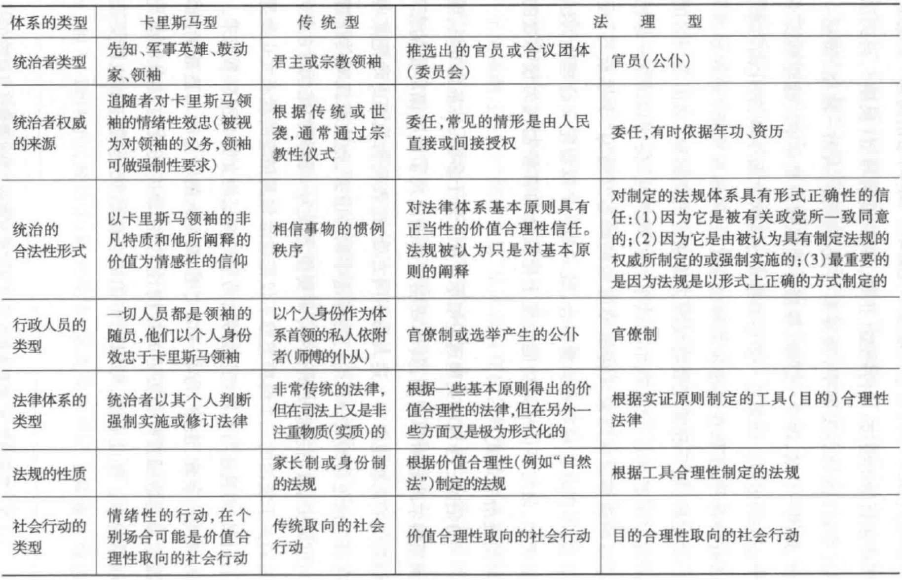
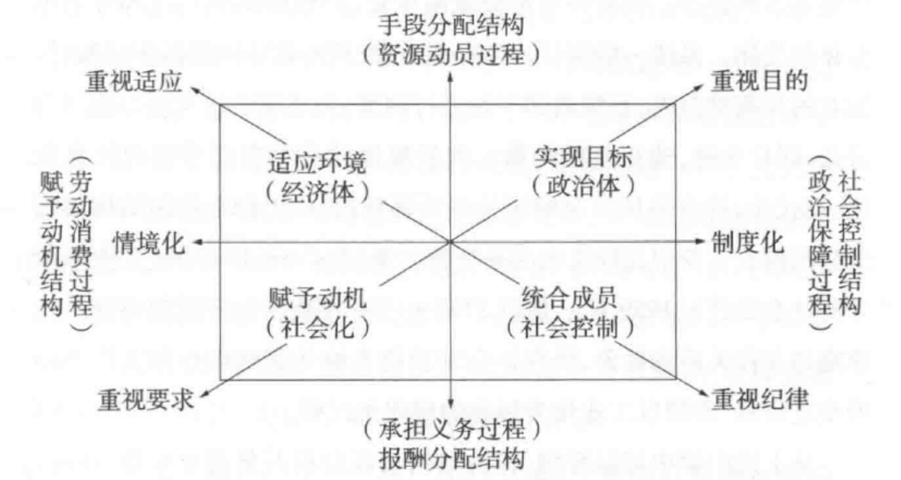

- _(z-lib.org)_1652593577393_0.pdf)
	- 第一章  韦伯其人与当代的"韦伯热"
	  collapsed:: true
		- 1 引言
		- 2 生前与身后
		- 3 以行动化解紧张
		- 4 国家主义者和自由主义者
		- 5 19世纪理性主义危机与新康德主义
	- 第二章 宗教社会学思想（一）：类型化比较研究
	  collapsed:: true
		- ((628093e8-2f58-4431-b28d-3ffa0809343e))
			- 禁欲主义与神秘主义，在新教伦理中，其实主要是用来区分欧洲基督教内部的差异。比如：加尔文宗，就是纯粹的禁欲主义。而到了虔信派或者路德宗，则渗入了更多的神秘主义成分。
		- ((628093fc-e05b-487f-81b6-55ba9da96803))
			- 基督教新教和佛教分别是禁欲主义和神秘主义的两个典型，它们处于矩阵对立的两极，即人世禁欲主义和出世神秘主义。
			- ((6280942c-71cf-47ae-899e-9d03afd6e02b))
			- ((62809447-f738-42f0-b331-5a7e1933d8de))
				- 但这种入世和理性主义都是非常不彻底的，由此看来，儒教当属于入世神秘主义。
		- ((62809479-ccf1-4138-8f15-c980c9944da2))
			- 一切以伦理为取向的行动，都可归并为两种准则，其一是责任伦理(ethicof responsibility) , 另一是信念伦理(ethicof conviclion)。
			- “这两种准则从根本上互异，同时又有着不可消解的冲突。两种行动的考虑基点，一个在于＇信念＇，一个在于＇责任＇。这不意味着信念伦理就不负责任，也不是说责任伦理就无视心情和信念。不过，一个人是按照信念伦理的准则行动在宗教上的说法，就是＇基督徒的行为是正当的，后果则委诸上帝＇，或者是按照责任伦理的准则行动行动者对自己行动＇可预见＇的后果负有责任，其间有着深刻的对立。“——《韦伯社会学文选》120页
			- 这个划分本身在伦理学里也是有重大价值的。
		- ((6280948e-435f-44a9-848b-708d0211aeec))
			- 进行社会行动就意味着：
				- 首先，进入习俗、制度、规范、法律等关系，参与为达成一定目的而进行的行动；
				- 其次，行动者要提出自己的目标，以示行动之必要性和正当性；
				- 复次，行动者要以一定的信念、价值或理想为自己行动的动机。
			- 在这三点中，意义都发挥着重要作用：前者以客观意义或他人取向为凭借，后两者则诉诸主观意义或自我取向。一般来说，主观意义和客观意义都以不同方式结合在行动中。
		- ((628094aa-78cc-40cc-b311-c5f0b88533e1))
			- 韦伯：不是思想，而是利益（物质的和思想的）直接支配人的行为。但是，观念创造出的＇世界图像＇，时常像扳道夫一样决定着由利益驱动的行为的发展方向。
			- 经济伦理：其实就是在研究，思想如何影响行动。
		- ((628094c1-1938-41bf-8dc5-2997919706da))
			- **这个表格，就是典型的韦伯的“理想型”了**，为世界宗教类型建模
			- 伦理先知-->禁欲主义-->责任伦理（工具）
			- 楷模先知-->神秘主义-->信念伦理（价值）
			- 入世-->此岸性-->合理性
			- 出世-->彼岸性-->非理性
		- ((6280b480-bf16-4961-b918-6a711243ba26))
			- 韦伯把宗教的这种理性化称为“世界祛除巫魅"(disenchantment  of the World)
		- P97~P98 社会行动被分为合理性与非理性两大类，而合理性行动又被分解为价值合理性行动和工具合理性行动两种。
			- ((6280b4f7-1d3a-4da4-9452-eace88e90959))
		- ((6280b536-6f65-4818-904d-6dcdf729ae59))
		- ((6280b554-4bb3-451e-97a3-6ee036b727da))
		- ((6280b61d-8760-43ff-af89-95f7c5a4a053))
		- ((6280b646-1d66-410d-b307-42250e9c236c))
		- 社会阶级分层
			- ((6280b6a3-62d5-4c6c-b2ce-06f878f8a829))
			- ((6280b6a9-5d7f-4eff-b402-76a2d43ee37a))
			- ((6280b6b0-1b15-4ff6-a9a1-51c45565def3))
			- ((6280b6b7-bdd3-4c14-a7c4-dda0c23ebef7))
			- ((6280b6bf-c27e-4761-8325-a0a3ec33a74f))
		- 后续可以深入研究：以印度宗教为代表的出世神秘主义和以中国儒学为代表的入世神秘主义的两种宗教类型
	- 第三章 宗教社会学思想（二）：发生学因果分析
	  collapsed:: true
		- 1 宗教与社会心理
		  collapsed:: true
			- ((6284dea9-5d65-485c-b0c0-f4e15005b861))
				- 1. 拥有土地、设备、机器和工具等一切物质生产手段作为独立经营的私人企业可任意处置的财产；
				  2. 必须有自由市场；
				  3. 要有合理的簿记会计制度；
				  4. 依据可预测的规律进行管理；
				  5. 必须有自由劳动；
				  6. 经济生活必须商业化。
			- ((6284e125-5849-4ccb-aa80-70f82137413b))
				- 在法律中是形式法律与经过专门训练的司法人员相结合的法律制度；
				- 在政治中是职责分明的分权管理，上级监督下级的官僚体制；
				- 在道德生活中殡弃宗法制度靠血缘、地缘维系人群结合的伦理传统主义、多元主义和特殊主义，奉行靠业缘结合的理性主义、一元主义和普遍主义的社会性伦理；
				- 在艺术领域是独树一帜的和声、配器、曲式、记谱方法和具有丰富表现力的乐队建制，以及合理地运用线条的独特透视技法;
			- ((6284e15e-3852-44dc-ac61-6e42a8fa94b3))
				- 前者称为“禁欲”，后者成为“理性化”
			- ((6284e33b-0444-46a1-a20b-49da88346d85))
			- ((6284e302-41b9-4f2c-b7d9-5f85e3cc5074))
			- ((6284e2c9-6100-4a5f-ac25-a07b494b328e))
			- ((6284e3ea-e96b-4cdd-8c03-3864122db89c))
				- 宗教伦理、实际伦理（阶层伦理）和经济伦理从作用于人的心理并形成人的社会行动的动机而言，都变成了社会心理学要素，亦即变成了宗教心理、阶层心理和经济心理。
			- ((6284e4c2-21bd-474e-89ce-a81dd7fc4ed7))
				- 韦伯的方法论个体主义与英国古典经济学的鲁滨逊式的个人以及唯理论哲学家从契约论角度强调的个人，又有很大不同；
				- 他是在社会心理学的意义上，从社会心理、群体心理最终要在个体心理水平中发挥作用的意义上，强调个人及其行动是社会学分析的最基本单位。
			- 韦伯的学术路径
				- 不能同意：把社会现象等同于自然现象，完全袭用自然科学的“社会物理学”（孔德）或“社会有机体论”（斯宾塞）
				- 不能同意：德国的“精神科学”传统，把一切都“非物质化”，并企图从这方面入手，形而上学地设定客观意义，使社会科学失去其实证的根本前提而历史哲学化，最终必然陷入历史唯心主义
				- 企图扬弃实证主义和德国历史学派的片面性，而对二者的合理内容实行综合
		- 2 西方宗教：基督新教和犹太教
		  collapsed:: true
			- 从天主教“出世的禁欲主义”到新教加尔文宗“入世的禁欲主义”
				- 路德：“将Calling翻译为天职”
				- 加尔文宗：“得救预定论”
				- 加尔文宗弃绝了包括圣礼、忏悔、教会等在内的一切宗教仪式，否认经由这些途径获取救赎的可能。
				- 教徒只能以世俗职业上的成就来确定上帝对自己的恩宠并以此证明上帝的存在。
				- 这正是入世禁欲实践的心理背景，也是新教徒理性的企业经营行为的信仰基础。
			- ((62864c1f-da6e-4b70-a7e8-0a37d20cd78e))
			- ((62864c79-fb6d-4247-a163-a80e8e583fee))
			- 作为一种社会心理的天职观
				- 对于入世禁欲生活方式的影响
					- 教徒需要过一种有系统、讲究方法的理性生活
					- 证明自己从“自然状态”进入“恩宠状态”
					- 表现在经济行动中就是利用交换机会以和平方式取得预期利润
				- 对于入世禁欲思想方式的影响
					- 资本主义精神应为：：人以其天职为任务，合理性而有系统地追求预期利润的态度。
					- 核心是合理性与禁欲：通过严密的计算和使用正当方式达到预期目的；
			- 对照组
				- 儒家学说作为一种世俗伦理体系具有清醒的入世理性主义，把现世视为安身立命之地，既没有超越的＂位格神"(personal god), 也不讲“彼世''(OtherWorld)的超验领地，因而缺乏形而上学兴趣，宗教意识也极为淡薄；它不像新教那样以理性态度改变世俗、驾驭自然，不能引发出改变世俗的力批，而用理性致力千维持现世的和谐秩序，最终以适应现世为标的。
				- 印度教和佛教专注解脱，缺乏入世理性主义，以神秘的＂梵我一如“和“证为涅梁”为终极关怀，采用自我折磨式的身心苦行修炼方法，其特征是＂逃避世俗”，因而无法从中发展出合理性而有系统的社会生活方式。
				- 天主教虽然也讲禁欲，但主张以隐修院的逃避方式消极地对待世俗，属千出世禁欲主义；它不像新教徒那样以聆听上帝的召唤作为上帝的选民来到世间，以“职业人＂的身份保持合理性而禁欲的生活方式而正面地排斥各种世俗的诱惑，因而无法产生改变世俗的力矗。
			- 在基督教内部的对照：以是否理性为标尺
				- 天主教：人们也可以在拉丁贵族崇尚奢华、激情和美感，充满无穷欢宴和纵情享乐的世俗生活中看到天主教情绪主义的表现。
				- 路德宗、虔信派：路德宗信奉与上帝“神秘合一＂的教义包含有神秘主义和情绪主义因素，虔信派(Pietism)也有某些激情的成分，这些都有助于中世纪出世禁欲主义的蔓延。
				- 循道宗：属于激情与禁欲的结合，虽然主张系统地获取救赎，但教义倾向千情绪。
				- 上述几个宗派都不同程度地存在有神秘主义或情绪主义的倾向，追求的是在世中得到拯救的喜乐，而不是驱使信徒为确定未来而做禁欲的奋斗，客观上无助于或阻碍世俗社会生活的理性化，因此，作为合理性的社会劳动组织的资本主义不可能在这些宗派占主导地位的地方首先发生。
			- 【感想】韦伯分析资本主义的兴起，肯定背后有一张地图+一条时间线，在时间与地理上，从荷兰到英国，再到美国的发展轨迹，以及资本主义发展缓慢的：西班牙、意大利、法国与德国。需要从宗教与社会层面来解释。也许可以去从头梳理一遍。
			- 分析犹太教
				- 备受苦难，反而引发自责，主要特点
					- 【一神论】信仰耶和华是世界性的一神
					- 【立约】认为以色列人是雅赫维的特选子民，人神立约，则永无反悔，不能废除。以色列民族和犹太教成为一个不可分割的整体。
					- 【十诫】宗教律法与世俗伦理相结合
					- 【弥赛亚】基于天国与现世的对立，犹太教宣称将有一位“救世主”来临拯救以色列民族和全人类。
				- 犹太教的合理性——后来为基督教所继承
					- 与希腊哲学推导出来的上帝观相吻合，把宗教信仰引入 理智思考的领域，促进了宗教发展的理性化
					- 人可以通过对《律法书》内容的知性理解来获知神之意志内容，在破除原始宗教不为理智所控制这一点上，犹太教是合乎理性的。
					- 既适用于整个以色列民族，也适用于外邦异族的义人，因而具有普遍主义的社会性，在伦理规范的普遍性和社会性上，犹太教是合乎理性的。
					- 在使世界历史过程与一种统一意义相联系的历史意识产生上，犹太教是理性的。
				- 犹太教的非理性因素
					- 自视为神的”选民”，在民族内部讲团结互助，对外则以冷酷的计算求营利，导致“对内道德”和“对外道德”的伦理二元性渐趋强化。
					- 一、以色列人这种只求营利的态度与清教徒以追求营利为义务的资本主义精神不同。
					- 二、在这种二元论伦理观的支配下，以色列人不可能与异教外邦人做平等的、靠交换机会营利的经济活动。
					- 囿于民族的限制，至多能发展起＂掠夺式”的资本主义或“商人式”、"贱民”的资本主义，而对于近代资本主义所固有的“自由劳动组织的理性化”这一本质特征，似无多贡献。
			- 韦伯论述的目的：为了论证近代资本主义为什么只能发生在新教占主导地位的地方这一结论，他对基督教各分支的论述是正面论证，而后对其他几种世界宗教的研究不过是从反面论证了这一结论。
		- 3 印度宗教：印度教和佛教
		  collapsed:: true
			- 中国类比法兰西、印度类比古代希腊
			- 关于中西方比较的疑问
				- 李约瑟之问：为什么古代科技发达中国没有产生近现代科学？
				- 韦伯之问：为何在前现代社会中国科技遥遥领先于其他文明？为何在现代中国不再领先？
				- 孔飞力之问：中国为什么没有发展出近代国家？
			- 韦伯并不排斥对同一现象做多元说明，在他看来，不同的人从不同角度选取特定的价值参照作为自己的尺度，只要坚持首尾一贯性无内在逻辑矛盾，那么每种解释都在自己学科领域内具有其合理性。但是，每种解释都应认识到自己的限度，而不应自诩为充足理由解释或唯一的、排他的解释。
			- ((628f2a00-1256-421b-8ba2-0a1d2dcec6f3))
			- 韦伯看到了“世界祛除巫魅＂的理智化和理性化的”意义”，在他看来，理性化是“我们时代的宿命”。
			- 韦伯关注的东方宗教：发源于印度的印度教是“正统”、佛教是“异端”；发源于中国的儒教是“正统”、道教是“异端”
			- 印度教的特点
				- ((628f2b0f-dc34-41cc-8e8f-77499de1ad12))
				- ((628f2b2e-f164-4925-ba8c-9b0f1f31e62a))
					- 印度的社会生活既为婆罗门僧侣制造的宗教枷锁所束缚，也为难以消除的传统主义所支配。
				- ((628f2b53-08bb-4bc4-8a6a-0ad016f36fd4))
			- 哲学和宗教知识具有神秘的直觉性质，便产生了两个重要的后果
				- 其一，由此种知识引出一种贵族式的精神救赎论；凡能拥有这种神秘直觉能力的人必然具有卡里斯马式的天赋，印度宗教承认只有少数人（主要是寺庙的僧侣）以特殊的生活方式才能获得这种能力，其他人只是信徒而已，这就使印度教具有了精英宗教或达人宗教的意味。
				- 其二，知识的本质具有非社会性和非政治性。对每一种相应的行为，都以严密有效的救赎论的报应加以说明，就成为印度社会定型化、僵死的传统和仪式。这就不可能像西方救赎宗教那样，指引人们珍惜现世、生命，以便抓紧时机履行“天职＂，在世俗职业上做出成绩，力求灵魂得到拯救。
			- 佛教、耆那教是印度教的异端，除了不承认种姓等级和婆罗门特权，其他的没多大区别
			- 印度教、佛教的这种出世神秘主义的宗教推行一种封闭的、保守的伦理体系，使宗教伦理与世俗经济生活不发生联系，客观上起到了阻碍日常经济生活的理性化发展的作用，造成了在印度社会公众生活领域中历来以传统取向的、伴之以巫术因素起作用的行动方式占据主导地位的态势。
				- 导致无法在印度诞生资本主义
		- 4 中国的“社会学基础”
		  collapsed:: true
			- 4.1《中国宗教》一书的概貌
				- 韦伯的导言题为《世界宗教的经济伦理》，后被改为《世界宗教的社会心理》
					- 讨论内容：社会各阶层的宗教意识对实际伦理和经济伦理的影响
				- 书的正文主要讨论“货币制度、城市商业行会、世袭制国家、官僚政治、宗法组织、法律”，论述中国的“社会学基础”
				- 中国的国家体制：帝王家族的延伸，化家为国
					- 国家财政被视为国君的私产
					- 各级官吏是皇帝的家臣
					- 官吏熟悉儒家经典，却不具备行政管理的专业知识
					- 世袭的官僚制
						- 欧洲中世纪封建制：逐级形成法律或契约上的效忠关系
						- 中国的官僚体制：以家长制父子关系比附的君臣关系
					- 人治重于法治
					- 传统主义占据主导地位，轻视专业知识，相信半部论语可治天下
					- ((628fa3bf-3dcd-40e9-b25f-dcca30188218))
				- 中国的官僚体制
					- 在辽阔的土地上力求实施中央集权、分层管理
					- 发展出一套严密的组织机构和治理制度，包含着重大的理性化因素
					- 病因
						- 专断独裁、历代官制的弊病、宗族组织与宗法势力
						- 山高皇帝远，导致无法建立有效统治
						- 官员迁转制度，导致官员尽力搜刮，削弱官僚制效能
					- 结果
						- 中国社会的长期二元结构
						- 一元：自上而下的中央集权的政治机构
						- 一元：自然村落、共同体或行会等自治组织
						- 在这二元结构中贯穿的精髓，却都是牢不可破的传统主义
				- 中国有很多有利于商品经济发展的因素，这一切都促使中国历史上多次出现繁荣昌盛的经济发展局面，并在此基础上发展出了悠久而灿烂的中国文化。
					- 人口的快速繁殖和增长
					- 百姓作为自由民可以自由迁徙
					- 不限制高利贷与经商
					- 敛财思想
					- 国内贸易与国际贸易
					- 出世救赎意识极为淡泊
					- 锱铢必较与量入为出
				- 但是，中国社会还踟蹰于传统主义归途而逐渐走入下坡路，最终导致资本主义”理性的社会劳动组织”形式未能在中国首先发生
					- 儒教的影响只是其中的一个原因，韦伯把其他原因归结为中国的“社会学基础”
				- ((629015a6-b080-40a6-bd78-20ebc46f17f3))
					- 但是，他的一些结论充满真知灼见
			- 4.2 中国的货币体制
				- ((62901705-a35e-4d58-acd8-2ad116cdd6d1))
				- 货币的使用是经济活动理性化的一个极其重要的方面
					- 它使能够交换的关系领域极大地扩展了
					- ((62906838-39d4-43d9-976d-eb00cbcf40e4))
				- 韦伯引用了很多文字训诂的材料证明：中国古代对于货币、财货的态度
					- 认为财富与幸福相连
				- 中国很早就开始使用货币，但是由于只重视衣业生产，货币经济直至近代还仅仅发展到埃及托勒密王朝（公元前332—前30年）的水平。
					- 货币的铸造掌握在一些基尔特式商行的手中
					- 铜币和银锭的兑换率在不同时间和地点上持续地呈现不稳定的波动，在许多情况下这可以视为[货币体系]部分崩溃的结果
					- 存在多种银两的衡量标准：“库平两”、“漕平两”、“关平两”、“官平两”，还有各种民间标准：“公码平”、“估平”、“司马平”、“苏漕平”、“申漕平”等等，统称“市两平”
					- 纸币也存在类似的情况：滥发纸币，导致纸币信号破产、通货膨胀
				- 韦伯对于中国货币体制的两点看法
					- 一、以贵重金属为表现的财富的巨大增长，毫无疑间会导致货币经济的巨大发展，这一点尤其体现在国家财政中。但是，伴随这一发展的并非是传统主义的解体，而是传统主义的明显增长。正如人们能够看到的，资本主义现象并未能在任何可感觉的程度上发挥作用。
					- 二、人口的大量增长既非受到资本主义发展的刺激，也未刺激资本主义的发展。至少可以说，人口的增长是与停滞的经济形式相联系的。
					- 在他看来，“把货币金属当作货币和非货币使用的相互关系所造成的深远经济后果，由中国货币史提供了最富有教益的例证，因为（中国使用的）铜币的生产花费昂贵而且（受到）货币金属采掘大起大落［的制约］，从铜币中可以特别清楚地看到这一复杂的现象。”
			- 4.3 中国的社会组织
				- 中国城市缺少西欧中世纪以来城市在政治和军事上的自主性，因而无法产生类似西欧近代的新兴市民阶级。
					- 由千缺乏形式的和可靠的法律来保护工商业的自由发展，从工从商的城市居民只能组成同业行会实行集体的自我保护。
					- 行会的基本权益无法受到法律的保护
					- 行会内部起作用的是传统的宗族观念，而缺乏理性的非人格化的关系，难以实行科学的理性计算，以致无法在此基础上形成自由与合作的社会劳动组织形式。
				- 宗族组织：来源于同一祖先的家庭依靠血缘关系的结合，以祖先崇拜和孝德为纽带的宗法组织。
					- 家庭是最基本的社会单位，它执行性、种族繁衍、生产和消费诸项职能。家庭财产为成员共同所有，家长是最高权威者，每个成员都要遵守家规家法，接受家长的领导，并须以维护家庭利益和荣誉为己任。
					- 宗族首领通常由族内最有威望、辈分高的长者或有名望的家长担任，他主持宗族的祭祀、丧葬嫁娶仪式，并对族内的纠纷诉讼行使裁判权。
					- 宗族除了具有宗祠、义地、义塾等公共财产外，每个家庭还有共同营修道路、疏浚河道、轮流负责治安、参与抵御外部入侵的义务。
				- 宗族聚居组成的乡：是国家的基层行政机构，设有里正、亭长、地保、甲长之类的职位
					- 受上一级的县、郡统辖，按期交纳赋税
					- 在内部封闭、自律
				- 中国的政治组织和社会组织自上而下都打上了父系家长制的烙印，即使是伦理道德也不例外。
					- 造成人们崇尚传统、注重人伦孝梯、以家族和同乡的好恶为是非标准的对内道德和对外道德的伦理二元性。
					- 客观上必然会阻碍资本主义精神在中国的发生和发展。
			- 4.4 中国的法律制度
				- 中国缺乏理性的法律和训练有素的司法官吏。
				- 中国历代的刑律本质上是＂伦理规范”即“伦理规范的法典化”，而不是法律规范体系；或者说，它是“实质的伦理法"(subst.antive ethical law) , 而不是能保障现代资本主义经济可靠运行的”形式法”(formal law)。
				- 形式主义原则是一切资本主义法律的重要特征，而一切前资本主义的神权政治，其法律形态的最大特点就是关注实质原则。
					- 形式法律：来源于罗马法中的形式主义审判原则的法律体系
					- 由一整套形式化的、意义明确的法规条文组成的
					- 将每个诉讼当事人都以形式上的“法人”对待并使之在法律上具有平等地位
					- 只依据法律条文对确凿无疑的法律事实做出解释和判定，而不考虑其他伦理的、政治的、经济的实质正义原则，同时还要排除一切宗教礼仪、情感的和巫术的因素
				- 传统中国的世袭制统治形式，决定了它的法律具有反形式主义和父系家长制的特征。
					- 没有正式的先前案例汇集，法律形式主义受到排斥，一切都像传统主义那样，
					- 西方法制在司法过程中按照试验方法力求与＇类似事件＇的处理保待一致
					- 【联想】而中国往往强调“辨证施治”
			- 韦伯的总结
				- 中国有很多有利于发展出资本主义的因素，但是“现代工业资本主义”，是以欧洲理性主义精神为基础，以理性的资本核算为集中体现，由一套独特的行为方式、思维方式和价值观念构成的文化体系。
					- 在中国的制度中，缺乏这样的因素
				- 韦伯分析特定社会的论述大都分为两个方面
					- 制度性构成因素的物质方面
					- 心理性构成因素的精神方面
				- 在分析制度性因素之后，要做出确切判断，还需要到精神部分——宗教思想上寻找答案
		- 5 中国宗教：作为“正统“宗教的儒教
		  collapsed:: true
			- 5.1 从终极托付的意义上看，儒学是宗教
			  collapsed:: true
				- 韦伯也把儒学主要视为一种伦理体系，在行文中往往儒学(Confucians)和儒教(Confucianism)混用不分。
				- 儒学作为一种伦理上的终极依托，几千年来在规范人们的行为和思想上起到了重大作用，其影响丝毫不逊色于任何一种宗教伦理。
				- 在韦伯的宗教社会学中，宗教是从它的社会功能上加以考察和规定的，因此，宗教与终极关怀、终极信仰，或与绝对价值、绝对伦理是同义的。
				- 本质上：是从社会学的角度研究宗教的功能
					- 不管何种宗教，都有类似的社会学功能
					- 凡是具有类似社会学功能的，都可以称之为宗教(?)
			- 5.2 儒学的天道观与佛教的“法”相类同
			  collapsed:: true
				- 法的释义
					- 法（印度哲学）：
						- 在传统印度社会中，法在历史上已经指称了各种思想，比如吠陀仪式，道德指导、种姓制度和民法与刑法。它的最常用含义附属著两个基本思想: 社会生活应当通过良好定义或良好调控的等级来组织，而在某等级内的个人的生活应当组织成确定的阶段。
						- 如法生活的人更快趋向解脱。而不如法意味着不和谐、不道德或错误。
					- 法 (佛教)：指佛教对世间、出世间的所有义理与修证的开示。
						- 任持自性—保持自体的自性（各自的本性）不改变，依此解法指具有自性的一切存在
						- 轨生物解—规范人伦，令人产生对一定事物理解之根据，依此解法指认识之标准、规范、法则等。
						- 在六境中法是指对应第六种感官意识的对境，六境指眼耳鼻舌身意，其对境为色声香味触法。
						- 因明用语，性质、属性之意。
						- 释迦牟尼的教法，即三宝中的正法。
					- 书中论述：
						- 据佛教经典，“法谓轨待＂（《成唯识论》卷一。）”｀轨＇谓轨范，可生物解；｀持＇谓任持，不舍自相"(《成唯识论述记》卷一）。前者指具有一定的规范或规律，人可以认识，后者指保持自性或质的规定性，故是其所是。）
						- 在佛教中，法指佛的教法，或称佛法。它泛指一切现象和事物的规律或规范，包括物质的和精神的，存在的和非存在的，过去的、现在的和未来的，亦即“一切法”、“三世诸法”等。
				- 儒家的天道观
					- 神义
					- 自然义
					- 人道义——以人道推及天道
					- 仁道义——以人之仁德推及天之仁德
				- 儒家把天道视为事物的普遍规范和规律，因而天道具有统摄人生、社会、自然、精神的作用，这是韦伯把儒学与佛教和类比的一个原因。
				- 儒家的救赎观
					- 儒家原则上不讲彼岸、来世的救赎
					- 但是通过仁德理想希望在现世得到健康、长寿和丰裕富足，追求道德的完美和人格的完善以期死后留有英名
					- 儒家的＂救赎＂，更多内容是指在道德和人格上避免或远离缺乏教养的野蛮状态
				- 儒家与佛教的相似处
					- ((6294cc71-fb87-494d-8d0e-a7420af2134e))
					- 无论何种解释，佛陀、佛身、法身都与作为唯一的、全能、全善、全美、全知、全在和全备的、至高无上的神一一基督教的上帝、伊斯兰教的真主安拉，具有质的区别
					- 通过苦行冥想达到与神合一境界是一切亚洲宗教的最高目的，而借助自我控制争取灵魂得到救赎则是西方宗教的终极追求；前者以印度哲学为源头，属于神秘主义宗教类型，后者则来源于希腊精神，属于禁欲主义宗教类型
			- 5.3 儒学的入世理性主义因素
			  collapsed:: true
				- ((6294cd0d-37f2-4056-8f80-b3095b8abdd4))
				- 儒教的主要社会基础是知识分子（儒生）和官僚阶层，知识分子讲理智，官僚讲现实，在这个意义上儒教具有鲜明的入世理性主义成分，但这种理性主义以其独特的方式与传统主义的“礼”相结合；
				- 儒教理性主义与新教理性主义的区别
					- 儒教的神秘主义
						- 崇尚楷模先知预言，讲信念伦理
						- 发展到宋明理学则把“格物致知”当作启发内心直觉达到＂豁然贯通”的手段，终极关怀在于现世的道德自我完成和人格完满的境界
						- 但是“敬鬼神而远之”，反对以苦行禁欲或极端放纵
					- 基督新教伦理：入世禁欲主义、理性主义，反对神秘主义。由“预定论”进而发展为“天职观”
				- ((6294ce28-fbc1-4771-b761-7848cd23064f))
			- 5.4 缺乏对形而上学的关心，使儒家陷入传统主义的束缚
				- 韦伯分析儒家的特点
					- 不关心上帝
					- 将宇宙与社会视为和谐的
					- 天人之际的紧张对立，被化减到最低程度
					- 人性本善，无原罪意识
					- 没有通过内在力量影响行为使之摆脱传统和习惯的杠杆
					- 不信神，也缺乏以神为后盾的伦理先知，因而无法对现世提出系统而被普遍接受的统一的责任伦理要求，致使社会个体缺少任何“内向的“道德挣脱，无法形成像基督教徒那样对自己邪恶和罪的本质加以系统的控制，也就无法形成个人的独立人格和自主伦理。
					- 没有个人在伦理上的自主和自觉以及缺乏内心的＂紧张性”，也就没有儒家摆脱传统和习俗的内在力量作为影响行为和精神的支点，这是儒家个人无法对其本性、对政治权威、对社会传统和习惯势力加以制约和抗衡的内在原因。
				- 几乎是一派胡言，这些明明就是儒家相对于基督教的关键优点
			- 5.5 在与新教对比中，认识儒学对中国发展资本主义的阻碍
				- ((6298b74f-6676-42e0-ad55-358a681bbb1a))
				- (1)儒教自身摆脱巫术的程度
					- 儒家在很大程度上缺乏形而上学的兴趣，致使中国自然科学尽管在古代就有长足的发展，但始终停留在纯粹经验领域，进入近代以后长时期蜘踝徘徊，裹足不前。
					- 无条件肯定现世和适应现世的伦理
					- 正统儒家把一切一时尚不能理解和无法把握的因素，皆归结为天、命、天道，并从命运的观点对之做出含混的解释，昭示人们“存其心，养其性，所以事天也"
					- ((6298b7f3-39ae-498c-9571-d159df6c0e29))
					- 儒家对道教和民间宗教并不从根本上加以排斥，致使中国长期以来容忍多种宗教长期并存。
					- 从权力结构上看，在现世中引入非理性的“天命”和其他一些巫术观念，也起到了挟制天子不可恣意妄为的作用。
					- ((6298b876-369b-4eb9-9621-9f13acc40a43))
				- (2)儒家伦理对世俗生活一体化、系统化程度的作用
					- 儒家伦理注重君子的修养，不注重专门实际才能的培养
					- 儒家说“君子不器”，而西方基督教把人看作神之工具（器），进而把个人限制在世俗的特定职业中，形成了特定的“天职观”
					- 儒家没有原罪意识，而更多是对出于“非礼”的耻辱意识
					- 儒家重现世的伦理思想是一种信念伦理，它把追求道德的自我完满当作最高理想，缺乏对达成这一目标的可靠手段，只能依靠＂笃信好学，守死善道”的个人修养
					- 再加上儒家经典中多有鄙薄物质利益的思想,致使人们在实际生活中无法形成统一的合理性经济伦理
					- 与基督教相比，儒学在促成世俗伦理和经济生活的理性化和体系化方面，相对来说程度较低。
				- (3)儒家伦理对人际关系摆脱传统主义影响的作用
					- ((6298bd21-1252-4595-bc4b-6bbbc6b80c96))
					- ((6298bd30-226f-45ff-ab05-1911c46ede78))
					- 因此，在人际关系方面，对传统秩序的适应构成了社会生活的基调。
					- 对比而言：基督教加尔文宗，绝对否认传统的神圣性。任何他人都无法替代个人灵魂得救，一切”有机的“人际关系都无由依靠。结果就产生了非个人(imper­sonal)性的社会道德。它要求对他人都应采用同一标准看待，倡导讲普遍主义的社会性道德。
					- ((6298bdd4-4a36-4c36-a9ab-5613a5d5538a))
		- 6 中国宗教：作为“异端“宗教的道教
			- 董仲舒“罢黜百家，独尊儒术”之后，儒家学说长期与国家行政机构、政治制度紧密结合，成为占主导地位的“正统”宗教，其他宗教在大部分时间里则以“异端”形式在民间流传。
			- 国家崇拜服务于社会利益；祖先崇拜服务于血亲氏族利益；都毫不关心纯粹个人利益。
			- 在中国广大下层民众的社会生活中一直盛行着多神崇拜。
				- 中国特色：把历史人物作为一种特定人格神当作祭祀对象，始于对孔子的神圣化。
			- 道教学说在主要方面与儒家学说并无区别。只是在后来，它才与儒学发生对抗并最终被视为彻底的异端”。
			- 在韦伯看来，儒、道都起源于中国典籍中记载的隐逸者。
				- 隐士，就是从现世中隐退专门诉诸思索和神秘感觉的人。
				- 儒家对逸民、隐者的理解：入世有为讲的是“为有所为＂，一旦在政见上与上峰祗悟，与其违心地”枉道事人”，毋宁“直道事人＂，被黜而隐退，做到“遗佚而不怨，厄穷而不闵＂。隐居对儒家来说，是处于失意时的一种变通或权宜之计，目的是避害，一旦时机合宜仍可出山施展治国平天下的抱负。
				- 道家的无为隐逸则是消极和神秘主义的。“无为自化、清静自正”的对现世绝对不关心的态度。
			- 儒家与道家对于道的认识分歧
				- 儒家
					- “道”在孔子思想中它是指宇宙的永恒秩序，同时也指这种秩序的运行过程。
					- 孔子言道都是与具体人事相联系
					- 儒家言“道”，不仅有对客观世界秩序及其规律的认识，而且也含有将此种认识与主观意志结合为一、依“道”而行即可通达世事的成分。
					- 不只是客观世界的表现，而且同时也是主观意志行动的根据。
				- 道家
					- “道”是一个永恒不变的元素，因而是绝对价值；它表征作为万物神性(thegod-head)的秩序，因而这是一个无所不包的、一切存在的永恒不变总体象征的观念。
					- 老子的“道”强调本体论的在先性。
					- 引用《史记》记载的那次有名的孔老会见，解释儒道之别
					- 对老子来说，至高无上的神是一种心理状态，是神秘的合一，而不是西方禁欲主义那种在积极的行为中确证的恩宠状态。
					- 老子主张达到这种状态靠排除理智和挨弃情感（＂弃智”、“绝学”、"寡欲”、“致虚＂、“守静")'但最终还是一种受心理制约的情绪状态。
			- 道家/道教对于中国社会发展的影响
				- 一方面，由于道教把“道“视为世界的最初本体，万物无不是“道”的衍生，现世中的一切都是从“道”的阐发上去认识的，这就使社会生活诸领域都充满了神秘主义色彩，各种事物都打上了“道”的巫术印记。这导致了占卜术、占星术、看风水等迷信观念的盛行，妨碍了理性的、分析的科学知识的发展。
				- 另一方面，由于“道法自然”，道教崇尚自然，追求长寿成仙，不为外物形累，强调按照自然本性去把握事物，使道家关注达到长生长寿的途径，例如讲究呼吸（＂胎息")方法、炼制金丹、寻求长生不老药（韦伯提到了秦始皇派人去东海寻找一事），客观上促进了中国古代医学、药学、化学、金属冶炼等经验知识和工艺的发展。
			- 从道生万物，到阴阳五行
				- 是＂＇道＇的系统的理性化”表现
				- 韦伯从发生学上充分肯定了作为儒道两家共同核心概念的“道”对中国古代社会生活理性化发展所起的作用。
				- 郭沫若：在秦以后，这一套观念更做了畸形的发展，成为迷信的大本营，妖怪的间谍网，窜入千最基本的生活习惯中，就像恶性癌肿的窜走络一样，足足维持了两千多年的绝对权威。到现在虽然被推翻了，而它的根萦依然没有拔尽。不过这是后来的事，是封建社会使这一思想走入了迷宫，没有得到合理的发展。这一思想在它初发生的时候，我们倒应当说它是反迷信的、更近于科学的。
			- 儒道合流与三教合流
				- 三者统一在传统主义上
				- 从实际效果上看，道教本质上的传统主义要比正统儒教为多
				- 在韦伯看来，儒道两家在具体表现上差异很多，但在根本点上是一致的，即以某种终极价值预设为理想，要求人们按照传统主义在现世中行动。（儒家的大同与道家的小国寡民其实相通）
				- 在中国，一切社会伦理把其他关系完全转换成有机（血亲］的孝梯关系并在对孝梯的关系中被认识。整个伦理之交都是由君臣、父子、夫妇、昆弟（包括师徒）、朋友之道构成的。
			- 道教“自身性质中的超宇宙的信仰和由此得出的对制度恩宠的贬抑有使它直接变成邪教的危险。用追求个人救赎之路去超越世俗人的现世道德，正像在基督教非禁欲主义的新教那里以追求制度恩宠去超越世俗人的现世道德一样，同样是无把握的"。
			-
	- 第四章 政治社会学思想
	  collapsed:: true
		- 1 统治与合法性
		  collapsed:: true
			- 韦伯的宗教社会学论证现代资本主义的合理性（rationality）；政治社会学论证其合法性（legitimacy）。
				- ((629cca81-2b4e-4eca-ae90-fb112a104c1f))
			- 权力（Power）：一个人即使在被别人反对的情况下仍然具有某种以其意志左右他人行为的能力。
				- ((629ccb3c-f76d-4d14-be30-37dd008475e1)) ：是指处于社会关系之中的行动者排除抗拒其意志的可能性，而不论这种可能性的基础是什么。
				- 权力施用的范围非常宽泛，既可以指家庭中家长对子女的管教，又可以指任何一个组织中上级对下级的命令。
				- 韦伯把其中的一种特定的权力施用关系，即“具有特殊内容的命令（或全部命令）得到特定人群服从的可能性”，称为“**统治**"(domination , 亦译**支配**）。
				- 它不包括以纯粹暴力的方式所达到的控制，因而“统治”也被他称为”**命令控制**"(imperative control)。
			- 服从动机
				- 习惯（子女对父母）
				- 对利益的权衡（雇工对雇主）
				- 情感（恋人之间）
				- 理想（宗教中教徒对教主、政治运动中群众对领袖）
			- 统治系统（权威系统）=自愿服从+信仰体系
				- 在社会生活中它表现为某个或一些具有发布命令权力的人和一些有责任服从的人所组成的组织，小到家庭、车间、班组，大到部族、民族、国家。
			- 信仰体系：说明为什么某人或某些人应该服从某种统治的理论体系或意识形态，它为统治的合法性提供理论依据。
			- **合法性**定义
				- 【韦伯】社会学所要讨论的统治系统的合法性，只能是（符合命令－服从关系的］相应态度存在以及由此引发出与之相符的实际行为二者相关程度的可能性。
				- 【个人理解】服从的态度与服从的行为之间相关程度的可能性
				- 【作者解读】合法性乃是促使一些人服从某种命令的动机，而不论这些命令是由统治者个人签发的，抑或是以通过契约、协议产生的抽象法律条文、规章或命令形式出现的。
				- ((629dee5c-129e-47eb-8d97-17a2b6d97cab))
				- 【概述】群体的服从性，取决于其对于统治系统的合法性是否相信。越是相信，越是会认为符合（合法性主张）的行动类型是**正当的**。
				- 一种价值中立的合法性定义，不是“是/否”问题，而是“程度”差别
			- 正当性分类
				- ①情感的正当性
				- ②价值合理性的正当性
				- ③宗教的正当性
				- ④习惯的正当性
				- ⑤法律的正当性
			- 行动分类
				- 情感型行动（①）
				- 传统型行动（④）
				- 价值合理性型行动（②③）
				- 目的合理性型行动（⑤）
			- 合法性统治形式的三个基础
				- 理性的基础（②、③、⑤）
				- 传统的基础（④）
				- 卡里斯马的基础（①）
		- 2 合法统治的三个纯粹类型
		  collapsed:: true
			- 2.1 卡里斯马型统治
				- 卡里斯马的四种形态
					- 战士：熊皮勇士、伟大英雄
					- 女巫：萨满教的巫师
					- 先知：摩门教创始人之类
					- 文人：凭借生花之笔宣传鼓动
				- 社会危机出现-->魅力人物崛起-->群众的信仰需要-->盲目崇拜与迷信-->巨大的革命力量
				- 纯粹的卡里斯马型统治是一种典型的反经济力量。
				- 卡里斯马共同体：以情感性的地缘关系（或称共同体关系）为基础的群体
					- 行政管理人员非专业，未经训练
					- 资格甄选既非以社会地位为依据，也不由家族门阀关系而决定，而是以其本人所具有的卡里斯马特质为凭据
					- 没有正式职务
					- 升迁全凭领袖指定
					- 领袖直接干预事物
				- 从根本说来是一种最不稳固、“非常态的"(extra-ordinary)统治形式
					- 领袖职位化（->丧失卡里斯马的涵义）
					- 以神意选择新领袖（->法制化）
					- 领袖世袭（->传统型统治）
					- 信徒推荐（->法理型统治）
			- 2.2 传统型统治
				- ((62a368b2-6fc5-4d60-8bec-707d754ce203))
				- 统治者个人命令的合法性
					- 内容基于传统
					- 又可能超出传统的范围
				- 服从者有心理上限，但反抗也需从传统中找到理由
				- 传统型统治的特征
					- 缺乏现代行政管理的官僚体制，行政人员没有明确的职权范围；
					- 上下级之间没有合理的等级制度，决定事务的权限不明确、不固定，有时依照先例，有时统治者派员决定或个人亲自干预；
					- 没有基于自由契约的任用制度和法规化的晋升、奖惩规则；
					- 行政人员缺乏专门技术训练，委任人员无视实际工作能力；
					- 与上述几点相联系，各级行政人员无固定薪酬。
				- 与卡里斯马类型类似：对于理性的经济行为起着严重的阻碍作用
				- 传统型统治对形式合理性规则造成严重的障碍。
				- ((62a36b0e-eb63-4064-a4d3-42b49e7b3d2c))
			- 2.3 法理型统治
				- 现代社会的统治形式
					- 法律具有至高无上的地位，这是一种以法律为依据进行管理治理的社会
				- 法理型统治的特征
					- 它是一种企业式经营的、受规则支配的、持续不间断的行为；
					- 它有明确的职权范围，以这种方式组织起来的统治单位，被称为“管理机构”；
						- 1. 执行分工系统分化出的特定功能的义务；
						- 2. 赋予在职者必要的权力；
						- 3. 明确规定带有强制性的必要手段以及使用这些手段的条件。
					- 各种职位按等级原则组成，下级服从上级的控制和监督；
					- 制约一个职位行为的可以是技术性规则，也可以是法规，因此实施制约必须经过专业训练；
					- 在这种理性的组织中，行政管理官员必须完全与生产工具或行政管理工具的所有权相分离，他们只是在履行职责时使用这些工具，而不是拥有这些工具；
						- 组织财产与官员家产分离
						- 办公场所与生活场所分离
					- 一切行政决策、决议和规章均须用书面形式表述和提出。书面文件和官员持续不断的操作管理，是现代各种组织化行动的主要特点。
				- 区别
					- 法理型：非人格化；卡里斯马与传统型：人格化
					- 传统型：保守封闭；卡里斯马与法理型：开放进取
					- 法理型：稳定、合理；卡里斯马与传统型：非理性
					- 法理型：更具有理性意义上的合法性
				- 法理型细分
					- 来源于对主观判定的某种终极价值的信仰，法律、法规、规章、制度是从终极价值公理系统演绎出来的并被认为是对其价值基本原则的阐释：价值合理类型/主观合理类型
					- 来自对制定法律规范体系的形式正确性的信任，亦即相信按照工具合理性（客观有效性）制定的法规具有合法性：工具合理性类型/客观合理类型
		- 3 "卡里斯马＂的核心地位
		  collapsed:: true
			- 用理想类型来描述各种形式的“命令-服从”关系。三个纯粹类型之间有一“理想的”依存关系，处于关键地位的是”卡里斯马型统治“
			- “卡里斯马”型权力是三个统治类型的实质表现
				- 卡里斯马->领袖魅力，是领导力的来源
			- “卡里斯马领袖”与尼采的“超人“有极为相似之处
				- 他们不但为其追随者设定新的价值，而且有一种要把人类升华为居高俯视世俗的英雄意向。
			- “卡里斯马”在三个纯粹类型之间起到联结作用，成为不同类型动态转化的中介
				- 卡里斯马领导追随者，造成革命性突破，引出卡里斯马型统治
				- 然后经历”常规化“转变为传统型
				- 再经历“理性化”转变为法理型
			- 类似亚里士多德《政治学》：君主政体->贵族政体->民主政体->君主政体的循环。
			- 黑格尔哲学的痕迹：传统型（正题）->卡里斯马（反题）->法理型（合题）
			- 有些循环论的影子，但是剔除了目的论。构建一种纯粹的结构性类型，并与政治、经济、宗教、法律、文明等关联起来。
			- ((62a5808a-9f14-4d90-9d6c-c3740cb92481))
				- 
		- 4 官僚制及其在现代社会组织中的推广
		  collapsed:: true
			- 官僚制/科层制，英语：bureaucracy
				- 官僚制偏贬义；科层制偏中性
				- 参见马戎：《科层制与官僚制——韦伯和列宁关于Bureaucracy的论述》
				- 参见[官僚制](https://zh.wikipedia.org/zh-cn/%E5%AE%98%E5%83%9A%E5%88%B6)
			- 官僚制的行政管理职能发生在属于法理型统治的理性国家
				- 古埃及，中国古代的统治，也不能算“理想类型”，因为它们缺少训练有素的官吏阶级和合理性的法律。
				- 中国的官僚缺乏行政管理的专业知识和技术
				- 中国的法律限公法，缺少私法功能的分化
				- 中国的官员制度未能发展成现代的官僚制
			- 价值合理性取向不断式微，工具合理性取向，更加符合功利主义的目标
			- 官僚制的工具合理性
				- 形式主义
				- 非个人性
				- 普遍主义
				- 将技术效率置于首位
				- 通过知识进行统治
			- 官僚制同时包含的非理性特征
				- 文牍主义
				- 本位主义与宗派主义
				- 孕育官僚主义
				- 形式合理性-->实质非理性
				- 专家政治或技术至上主义
			- 韦伯对官僚制的分析和研究开启了组织理论和组织社会学的先河
		- 5 合理性与形式主义法律
		  collapsed:: true
			- 韦伯思想的核心：合理性
				- ((62ad5ce4-7658-4b66-94f7-284a7d9bd9d6))
			- 哲学范畴：理性主义者与经验主义者的对立
			- ((62ad5dc3-e487-4839-b436-85dd2f081f2b))
				- 法律体系：命令性成分（制定法/欧陆）与传统性成分（习惯法/英美）的混合
				- 自然法理论在进入19世纪以后，受到巨大挑战，取而代之的是基于实践理性的形式法学理论
					- 逻辑演绎的自然法理，无法应对现实矛盾
					- 社会动荡、大革命与恐怖统治使得社会契约论破产
					- 基于实践比基于理性的法律改革会对社会带来更有效的结果
			- 合理性的涵义：从罗马法的形式主义原则中发展出来的现代西方的理性法律，主要特征是司法程序的理性化。
				- 第一种：形式的司法，由法律支配的
				- 第二种：法律关系的体系化，体系化的
				- 第三种：基于抽象阐释意义的法律分析方法，基于逻辑分析意义的
					- 坚持事实外部特征
					- 通过逻辑分析、解释的法律概念，形成体系化形式中的法律规范
				- 第四种：非（僵死的形式和非理性的）原始法律，由理智控制的
			- 现代法律的特征：
				- 实体法与程序法的区分
				- 法律问题与事实问题的区分
				- 立法与司法的区分
			- 现代法律的制定过程的合理性-->司法的判决具有了可靠的预测性
				- 由代议制立法机构自觉有意识地制定和创造的
				- 立法程序本身受到法规的制约，立法活动是在遵守法律形式结构的要求下进行的
			- ((62ad660b-6273-4c26-9ae1-c30dff6cbdb3))
				- 合理性被广泛地应用于经济、伦理、宗教、文化诸领域。
				- 在经济中是复式薄记
				- 在政治中是官僚制
				- 在法律中是形式主义原则
				- 在伦理中是新教禁欲主义天职观-->资本主义精神
				- 在艺术领域中是西欧音乐、绘画透视技法
			- ((62ad66f3-23b0-42e6-8091-92f47e829f9e))
				- 与黑格尔哲学的关系
				- ((62ad6757-94eb-4b04-ae4f-6210d644531c))
				- 韦伯……考察理性实现、展开的过程，作为对新教伦理、资本主义精神、官僚制考察的出发点，并贯穿在他的社会学分析的始终。
		- 6 形式合理性与实质合理性
		  collapsed:: true
			- 合理性是相对的，需要从特定的目的来看，才能判断是否合理
				- （一）合理性不是来自事物本身，而是被归因千事物的；
				- （二）合理性是一个相关概念，只有从一个特定角度上看，事物才被认为是合理性的或非理性的，而事物本身无所谓合理性或非理性。
			- **形式合理性**具有事实的性质，它是关于不同事实之间的因果关系判断；
			- **实质合理性**具有价值的性质，它是关于不同价值之间的逻辑关系判断。
			- **形式合理性**主要被归结为手段和程序的可计算性，是一种客观的合理性；
			- **实质合理性**则基本属于目的和后果的价值，是一种主观的合理性。
			- 韦伯构建了很多价值中立的社会学分析概念
				- 合理性、统治、合法性、卡里斯马 --> 政治社会学
				- 神秘主义、禁欲主义、先知、救赎和神圣性 --> 宗教社会学
				- 责任、意义、正当性、价值、文化、冲突和过程 --> 总体概念框架
			- 韦伯把现代资本主义、法律和官僚制，以及清教徒的职业伦理观的本质理解为合理性，而且是一种纯粹形式的合理性。
			- ((62b07e76-d75c-4372-a83b-ecd7630732e9))
			- 区分形式合理性与实质合理性，用于考察和分析现代西方社会秩序的特殊紧张冲突关系
				- 特别是来自资本主义经济中强调功能、效益的形式合理性与从平均主义和博爱价值观点上看是实质非理性之间的紧张冲突关系
				- ((62b07f4e-f22c-4752-9e0d-2835ec57dee3))
			- ((62b081a5-283c-4e8c-82e4-6751523377b3))
				- 【评论】可以联想到罗尔斯的《正义论》，“作为公平的正义”
			- 形式合理性与实质合理性的对立：即以可计算性、效益和非人性为一方的价值，与博爱、平等和兄弟友爱的价值为另一方的对立。
			- 在现代资本主义社会秩序和经济秩序中，作为最大限度形式合理性先决条件的契约自由，是一种形式上中立的制度，但在实际上绝非中立的。
				- 经济上的特权群体从市场交易中获得他们的权力，因而他们力主实现最大限度的形式合理性。
				- ((62b082cc-58e0-4b0e-bf7f-4942d3656696))
		- 7 现代社会的二难抉择
		  collapsed:: true
			- 从康德的哲学到韦伯的社会学
				- 纯粹理性->工具合理性->形式合理性
				- 实践理性->价值合理性->实质合理性
			- 区别
				- 康德认为：实践理性高于理论理性，不计后果，遵守善良意志是道德的基础，行为只有遵照绝对命令才是真的的道德行为
				- 韦伯认为：甚至在个人行为的领域中，也有一些不是伦理依照自身的假设所能解决的伦理问题。
					- 伦理行为的内在价值，是否能够证明行为的正当？
					- 是否考虑到对行为可预见的后果负有责任？
			- ((62b71872-2031-4f61-8235-fb5af48b52fe))
				- ((62b71a85-4cf6-4529-a258-daef1af52a89))
			- 人对社会的认识是相对的，人只能认识社会的现象，社会的本质是无法认识的
				- 形式合理性和实质合理性的二难推理是一个使韦伯长期感到困扰和痛苦的理论难题，也是他最终对社会生活理性化发展的前景持悲观主义态度的思想根源。
			- ((62b71b27-c231-470e-9837-4e2bc546633d))
				- 形式合理性的市场经济，实质非理性
				- 实质合理性的计划经济，形式非理性
			- 在社会形态上的区分：资本主义与社会主义
				- 资本主义相当于客观的社会结构（生产方式、经济构成），而社会主义则被看成意识形态的产物（主要是价值观、信念、理想）。
			- ((62b7caba-01e9-4316-bab7-5ffa8d19e502))
				- 独断的官僚制，形式合理性，实质非理性
				- ((62b7cc6f-dc48-4141-abf7-54730733103d))
				- 【评论】这里的对仗不公整，也许应该讨论打到官僚体制的革命体制，追求实质合理性，却造成了形式非理性。
			- ((62b7ccf6-64f1-4586-8c23-91aff1bbc8a7))
				- 各种组织都开始“官僚制化”
				- ((62b7cdb8-3666-4329-9885-9666452f4297))
				- 【总结】即使在社会主义国家，为了追求经济上的实质合理性，也会依赖高度强化、形式合理性的官僚体制。
				- 【总结】这也是韦伯在整体上对于人类社会的悲观前景的认识。
		- 8 "作为职业的政治”
			- ((62beb2ad-c402-4398-80f1-3ab429d928cd))
				- 一方面批判“总体轮”、“有机论”的国家观
				- 一方面驳斥“和平主义”与“革命主义”
			- 国家是主张在特定疆域内自己有合法使用武力的垄断权力的人类共同体。注意：特定的＇疆域＇是国家的一个特征。特别是在当代，只有在国家允许的范围内其他一些机构或个人才有使用武力的权力。国家是使用暴力的＇权力＇的唯一根源。因此，对我们来说，＇政治＇意味着追求分享权力或对于权力的分配发生影响一一无论是在国家之间抑或是在国家各群体之间。
			- 韦伯：自由主义式的国家主义
			- 政治制度的对比与宗教的对比
				- 英美 vs. 德国
				- 清教、加尔文宗 vs. 路德宗
				- 禁欲主义 vs. 神秘主义
				- 将原则性使用暴力视为捍卫信仰的手段 vs. 将个人为战争承担的伦理责任转移为个人服从权利而非信仰权利
				- 国家和政府只是为了人的世俗目的而设置的机构，没有丝毫神圣性 vs. 国家权力被视为神所需要的世俗政府，应该自觉虔诚的服从，具有神圣性
			- 官僚制急速扩展 -> 工具合理性成为普遍行为方式 -> 导致社会生活常规化、定式化、停滞化
				- 在官僚制运行中起主要作用的是“官僚＂，而不是真正的“政治家”。
				- 需要用“政治家”取代“官僚”
				- 政治家是“为了“权力而活，而官员是“依靠“权力而活。
			- 真正的政治家->社会行动者->责任伦理->信念伦理
				- 热情
				- 责任感
				- 判断力
			- 韦伯的政治理想：通过直接投票的民主政治选出精英（卡里斯马），作为政治家来管理官僚 = 有领袖的民主制
			-
	- 第五章 社会科学方法论
	  collapsed:: true
		- 1 社会认识中的“客观可能性”与“适合的因果性”
		  collapsed:: true
			- 韦伯的社会学方法的来历
				- 德国古典哲学的历史主义与以近代实验科学为主要体现的英法实证主义
				- 类型化比较研究和发生学因果分析
				- 自然主义/自然科学与历史主义/历史学派
			- 韦伯反对：对社会现象的“因果性”做人类中心的理解。
				- 各种社会科学在探讨社会现象的形成原因时，都预设有一种超自然的人化主体在起作用，这是一个能统摄整个社会的巨大意志。
				- 自然法则、隐藏的神、看不见的手、因果报应、神义论等等都类似于某种“因果决定论”
			- 李凯尔特（1863～1936）：文化科学不同于自然科学之处
				- 自然科学：只考察本质、共性，抛弃个别性、特殊性
				- 文化科学：只有那些在其对象的个别性方面表现出来的文化价值才是具有“意义”的事物，才是本质的
			- 韦伯社会学的哲学基础——来自康德
				- 可能性：现象与规则如何可能？经验的形式条件（相关性）
				- 现实性：世界本身如何可能？经验的实质条件（实体及属性）
				- 必然性：现实性和可能性亦即经验的实质条件和形式条件的综合（原因及结果）
				- 康德（线性因果）-> 新康德主义（概率因果）
			- ((62c108ed-0a20-4bf3-8eb7-13808b553826))
			- 韦伯的社会学目标与方法
				- 寻找适合的因果性，而不是详尽无遗的因果回溯
				- 寻找客观可能性，就是在A->B的情况，估算B发生的几率，有多少比重是因为A？
					- (1)将给定事件分解为诸因素，直接资料则被看成是“可能性和因果关系的符合";
					- (2)各因素可看作“经验规则”的特例，因而具有普遍性的行动过程均可被纳入其中加以思考；
					- (3)借助“想象”，在一连串互为因果的事件系列中，把所要考察的因素排除；
					- (4)其他因素作为条件存在，按照“经验规则”，可以期待它们有怎样的可能后果；
					- (5)把事件在想象中的发展与现实中的发展加以比较，如果后果相同，那么被排除的因素可能只具有偶然或次要意义；如果后果不同，那么这个因素则可能起到至关重要的作用。
			- 韦伯的因果多元论：一种辩证的，历史的，看待因果，分析因果的方法
		- 2 社会科学的“价值中立性”
		  collapsed:: true
			- “价值”概念的梳理
				- 经济学概念：物品具有的一种社会属性
				- 哲学概念：最广义的善的含义
					- 新康德主义：文德尔班，把哲学视为一般价值的科学，研究绝对价值判断的原理
					- 尼采：重估一切价值
					- 哈特曼的一部著作题为《价值学纲要》，对最广义的善的专门哲学研究即价值学（axiology）
				- 工具价值 vs. 固有价值（终极价值）
					- 方法的善 vs. 目的的善
					- 作为某一目的是善 vs. 作为整体是善
					- 某事物之所以有价值是由于它是被想望的 vs. 某事物之所以被想望是由于它有价值
			- 韦伯对于价值判断的看法
				- ((62c6d9ae-f954-440c-9ed4-a91baa668d6e))
				- 反对[经济学新历史学派](https://zh.wikipedia.org/zh/%E7%B6%93%E6%BF%9F%E6%AD%B7%E5%8F%B2%E5%AD%B8%E6%B4%BE)：在社会理论（社会政策）中，加入伦理因素，带有浓厚的主观性与伦理性色彩。
			- 区分经验科学与价值判断
				- 存在（is）与当为（should）
				- 实然与应然
				- 能做什么（想做什么）与应该做什么
				- 科学任务与实践任务
				- 因果分析绝无价值判断，价值判断亦绝非因果说明
				- ((62c6fe73-edbf-4631-b6e3-46e97670a5e8))
			- 社会科学研究时，应把对象视为有价值的对象，使用与价值相联系的方法，但是在态度上保持客观、价值中立。研究本身不能变成价值判断。
				- 科学内的禁欲主义
			- 对实践的价值判断的结构分析
				- 在实践的价值判断中归纳价值公设
				- 从价值公设推演价值判断
				- 根据特定判断付诸实践，并预测可能的结果
			- 韦伯的追求
				- **理解的社会学**的任务，在于把握主观思考的意义
				- 通过主观思考 --> 目的-手段合理性行动
				- 认识社会生活中的目的合理性关系 -->  促使目的合理性行动成为可能
				- 行动与道德责任相联，自觉地过着既是合理性的又是符合道德的诚实生活
			- ((62c7ce3e-9699-4fa5-8d14-92b7a67629d8))
		- 3 现代价值领域中的“诸神斗争”
		  collapsed:: true
			- 社会现象的“意义”，是由行动者的价值观点决定，并赋予的
				- 研究社会现象，应该基于“价值中立”去理解，不应代入“价值判断”
				- 科学研究，应该不做，或悬置“价值判断”
			- 现代性对于科学造成的后果
				- 任何一门科学的预设公理，都无法自证其是 --> [哥德尔不完备定理](https://zh.wikipedia.org/zh-cn/%E5%93%A5%E5%BE%B7%E5%B0%94%E4%B8%8D%E5%AE%8C%E5%A4%87%E5%AE%9A%E7%90%86)
				- 科学不能回答“伦理学”的问题
			- 信念伦理与责任伦理
				- 这两种态度尽管出于完全不同的终极价值而完全对立，但都是正当的。
				- 无法从科学立场，评价不同的价值观的优劣
			- 韦伯在真、善、美和神圣的价值关系之间做了相对主义化的处理
				- 它们所代表的价值之间永远处于无法消解的冲突之中
				- 这是韦伯针对孔德企图建立一门包揽一切的、总体的、普遍的“社会学”所做出的批判。
			- 【评】现代社会，诸神祛魅，科学“禁欲”，价值中立
		- 4 “理想类型”与“理解的社会学”
		  collapsed:: true
			- 韦伯社会学思想的特点
				- 探讨社会生活的本质、人们行动的动机、社会行动的意义
				- 认识与理解社会需要概念工具-->**理想类型**-->实施“理解的社会学”的概念工具
				- 通过可能性（因果关系）认识现实性（因果关系）
				- 类型化的比较研究+发生学的因果分析 => 比较+理解
			- 理想类型是什么？
				- 不是对事实进行概括，不是某种理想。而是一种抽象建构得到的典型
				- 方法论立场是价值中立的
				- 是一种构成方法，是看待历史的文化现象的一种角度
				- 是处于特定阶段的“历史的文化现象”的逻辑和规则
				- **理想类型**是主观构建的可能性 -> 个别事物能够被纳入规则 -> 事物才具备了客观必然性 -> 在此基础上才能讨论适合的因果关联 -> 以此为个别化研究服务
			- P286 借助思维抽象，他用经过理性手段选择的动机引出相应的人们行动的类型，依靠这些行动类型建立起今天科学上称之为“模型”的东西，这就是他的“理想类型” 。
			- 社会学方法不同于经济学方法，要考察意义与行动的主观原因
				- “理想类型”又是时代意识和时代精神的形式，因而成为比经济行为模式和社会结构具有更广泛内容的一种从“社会”亦即从全面、总体上看待世界的观点 。
			- **理解**的社会学
				- 说明原因
				- 解释意义
			- 韦伯的社会科学方法论
				- (1) 对社会科学中局限于自然科学的”规则学说明" (nomological explanation) 的批判。
				- (2) 在社会科学中用“原因”说明模式取代“自然规律”说明模式，他的说明把“动机“看作原因 。
				- (3) 原因说明模式包括 ： “解释“社会行动的概念要破译”意义” ； 反过来又要把“动机”、”意图”、”意向“当作理解行动”意义”的钥匙来思考；“游戏规则" (the rule of the game) 、道德簇言或实践座右铭起着决定社会行动过程的“原因“因素作用 。
				- ( 4) 由 于上述原因，发现“意义”即“理解”和“解释 “在逻辑上或认识论上不同于在物理世界中发现”规律”和“原因“，尽管这两者都依靠假设和使用”概念形式化工具” 。
				- (5) 在一切知识领域中都有“体验”和“认识”之分；所以“直觉”在形成假设中的作用，适用于一切知识领域；同样，对假言判断的验证或证实，从逻辑上看也适用千一切知识领域 。
			- 社会科学的范式转换
				- 概念构成+理性实验 -> 理想类型+理解的社会学
				- 社会科学的发展不是 一 个线性的积累过程，而是理想类型体系的飞跃式更替过程
				- 文化中不断变化的观点，导致提出不同的问题，就会得到不同的理想类型
				- 【没看懂】卡尔·波普尔的反对意见
		- 5 “作为职业的学术”
			- 韦伯：出于理智诚实坚守价值中立的一贯主张，严格区别教师、学者与政治领袖、宗教先知的不同角色地位 。
			- 科学的意义是什么？
				- 科学使人们获得关千技术的知识
				- 科学教给人们思想方法
				- 科学可以使人获得自我清明的认识
			- ((62d80e92-5e29-471b-bee2-d0c5115d1fd0))
				- 科学的独立自主地位不受外部侵犯
				- 为以科学为职业的人确立了行为规范
					- 学者只有提供事实的权利
					- 学者必须自觉地意识到自已知识在限定范围内的有效性
					- 学者必须有为真理献身的热情和理智上的诚实
			- 韦伯的两顶帽子
				- 作为学者：严守价值中立
				- 作为政治的积极参与者：积极表达政治观点
			- 在韦伯这里，康德的与目的相联的“自在之物”就变成了认识的“极限”概念：人们通过行动可以无限地趋近“自在之物 ”，但行动每前进一步，“自在之物”就后退一步，永远也不会被认识；它既为人的认识能力规定了最终限制，也为认识提供了无限的可能性 。
	- 第六章 韦伯的影响
		- 1 韦伯与现代西方社会学理论
		  collapsed:: true
			- 西方社会学发展简史
				- 法国：孔德《实证哲学教程》
				- 法国：涂尔干，实证主义-自然主义方法
				- 19世纪末，传到美国与实用主义思潮结合，成为一门使用自然科学计矗化方法以研究和解决实际社会问题为主的经验科学 。
				- 20世纪20~40年代的芝加哥学派
				- 战后50~60年代，帕森斯的综合与曲解
				- 60年代起，舒茨将现象学引入社会学
			- 帕森斯：结构功能分析学派
				- 《社会行动的结构》——涂尔干、韦伯、帕累托等思想的综合
				- 社会行动是行动者的互动 (i nteraction) 过程，是社会化了的社会行动者的互动 。
				- 
				- 五种模式变量：传统社会与现代社会
					- 情感性与情感中立性
					- 扩散性与专一性
					- 特殊性与普遍性
					- 重身份与重表现
					- 集体主义与个人主义
				- 突出了韦伯理性化概念的目的——手段合理性一面，在他那里这种合理性变成了结构 － 功能合理性，强调的是现代社会的形式合理性一面，因而最终把韦伯的理论视为现代资本主义的先知预言
				- 帕森斯理论存在的问题
					- 把合理性单纯归结为目的－手段合理性
					- 把韦伯理论本质上具有的历史主义 、 历时态分析->结构主义化、共时态化，
					- 肯定当下->取消理论对现实的批判立场
				- **把现代化完全归结为工具理性化，在方法论上带有相当片面化的弊病，将韦伯丰富而复杂的理论，简单化了。**
			- 舒茨：现象学社会学
				- 把胡塞尔的“生活世界”和“互为主体性" (intersubjectivity) 引入社会学
				- 对科学的世界图景进行现象学还原 -> 生活世界/社会世界 -> 个体意识 -> 理解/意义 -> 社会学概念
				- 互为主体性->可交换性/一致性->观念的客观性
				- 社会科学的主要任务是”获取关于社会实在的有条理的知识”，而社会实在被他规定为：”由在他人中间过着日常生活并与他人发生互动关系的人的普通思想所体验的社会文化世界的客体和现象的总和“ 。
				- 继承“理解的”社会学传统，竭力突出韦伯思想中主观性作用的一面，取消了韦伯强调的要对“合乎规律的规则”进行研究的客观性内容。
				- 这样的社会学，有将社会学哲学化的危险
		- 2 韦伯与马克思
			- 韦伯站在国家主义和自由主义的立场反对社会革命，因此与马克思主义存在分歧
			- 《对唯物史观的实证批判》还是由于不了解辩证唯物史观，错误的批判了庸俗唯物史观
				- 恩格斯还承认，“青年们有时过分看重经济 方面，这有一部分是马克思和我应当负责的 。“
			- 韦伯对马克思的另一个指责是说社会主义一旦建立之后必将强化官僚制，亦即实行官僚制专政而不是无产阶级专政 。
				- 实际上，社会主义会要求比资本主义有更高程度的形式官僚制化。
				- 马克思对官僚制的看法
					- 在官僚制行政组织本质的理解上，与韦伯类似
					- 社会结构（社会关系）最终不是来自政治关系， 而是来自经济关系。这是与韦伯的本质差别
					- 官僚制的国家机器所导致的人的异化现象，只有在扬弃了私有制的阶级对立和异化劳动之后的未来共产主义社会中，才能得到根本的消除。
			- 韦伯也有受到马克思影响的一面
				- 对经济因素在社会历史发展过程中 所起作用的重视
				- 对地位群体以及阶级利益冲突的分析
			- 韦伯认为，资本主义不像马克思所说那样是历史发展的必然产物，而是一系列历史因素巧合的产物。
				- 这是一个必须正面应对的挑战
		- 3 结语
			- 韦伯：复杂、矛盾的思想家
			- 韦伯个人的内心矛盾是资本主义世界在两个世纪之交精神危机的人格化表现
				- 一方面作为一个理性主义者，他坚信不能消除最高的和最根本性的理性（真理性）原则；
				- 另一方面作为一个自由主义者，他目睹了两个世纪之交由于资本主义的残酷压榨和疯狂掠夺所酿成的人类相互残杀的战争，清醒地意识到，由于追逐理性化，人类历史正在产生着严重威胁自由主义根基的过程。
			- 韦伯把资本主义作为合乎人性的和合理性的社会制度来加以论证，不断地与自己的基本前提——私有制关系一一发生矛盾，因而他又不断地违背自己的基本前提，从而使他陷入了深深的自我矛盾。